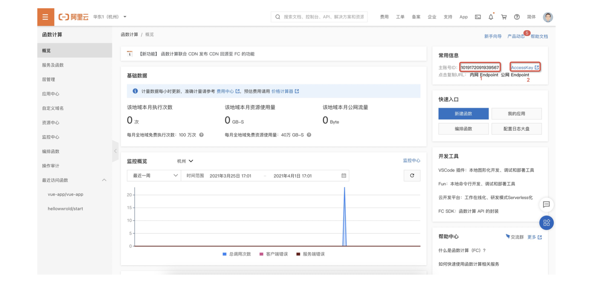
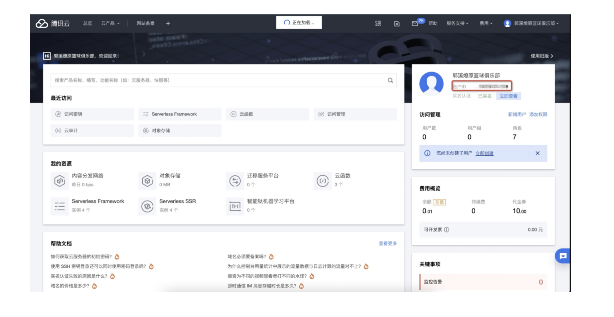
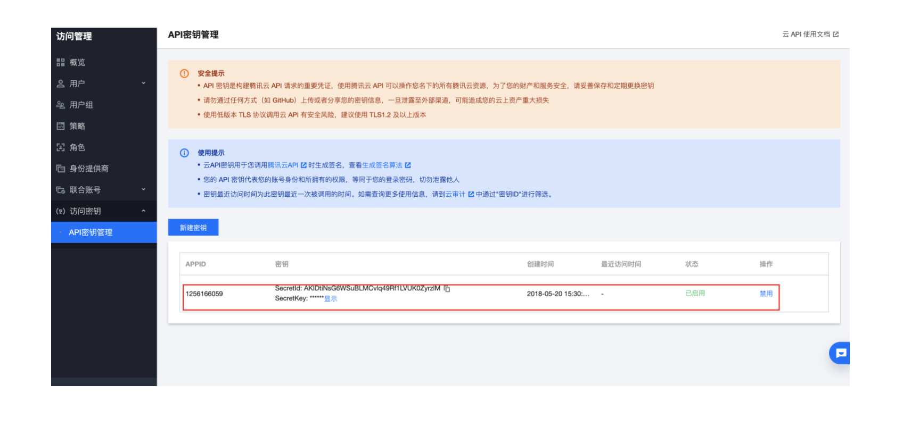

## 平台账号配置方式

当我们需要把 Malagu 应用部署到不同的云厂商的时候，我们需要通过一些方式提供 AKSK 给框架，框架使用 AKSK 部署到对应的云计算平台。不同的云厂商，会有不同的适配器，但是在 AKSK 的配置上会尽可能保持统一。框架提供如下方式配置 AKSK：全局配置文件 < 项目根下的 < `.env` 文件 < 环境变量 < 组件属性配置文件。框架提供了一个 `malagu config` 命令方便我们快速配置全局配置文件。


### 全局配置文件


全局配置文件，一般不需要我们手动创建。当我们在执行部署命令的时候，框架发现当前环境下没有配置 AKSK，命令行将主动提示我们需要输入 AKSK 相关的信息，输入完后，自动保存到全局配置文件中。全局配置文件位置为 `~/.malagu` ，不同云厂商分别对于着不同的目录。如下所示：

- 阿里云： `~/.malagu/alibaba/profile.yml` 
- 腾讯云： `~/.malagu/tencent/profile.yml`
- AWS： `~/.malagu/aws/profile.yml`


绝大部分情况下，我们无需手动去配置全局配置文件，Malagu 的命令行工具提供了一个命令 `malagu config` 方便我们配置， `malagu config` 会根据项目的依赖情况，自动选择合适的云平台配置文件进行配置。例如，项目中依赖了 `@malagu/fc-adapter` 模块，则自动配置为阿里云函数计算平台的账号信息。
### 项目下的 `.env` 文件


当我们想让某个项目拥有独立的 AKSK 的时候，我们可以在项目根目录下面放置一个 `.env` 文件，通过 `.env` 文件配置 AKSK，`.env` 文件内容，如下所示：
```
MALAGU_REGION=cn-hangzhou
MALAGU_ACCESS_KEY_ID=xxxxx
MALAGU_ACCESS_KEY_SECRET=xxxxxx
MALAGU_ACCOUNT_ID=123456
```


### 环境变量


分别设置一下相关环境变量：
```
MALAGU_REGION=cn-hangzhou
MALAGU_ACCESS_KEY_ID=xxxxx
MALAGU_ACCESS_KEY_SECRET=xxxxxx
MALAGU_ACCOUNT_ID=123456
```


### 组件属性


Malagu 框架的组件属性是通过 `malagu-[mode].yml` 配置，配置方式如下：
```yaml
malagu:
  faas-adapter:
    credentials:
      accessKeyId: xxxxxx
      accessKeySecret: xxxxxx
    region: cn-hangzhou
    account:
      id: 123456
```


### 注意事项


- AKSK 属于敏感信息，切记不要将该信息提交到代码仓库。
- 腾讯云和 AWS 可以不同提供 account 信息，阿里云必须提供。
- 组件属性方式配置，尽量配置为后端组件属性
- 在 CICD 环境中，可以使用环境变量方式提供 AKSK


## 阿里云账号获取方式

### 阿里云部署


当首次运行 malagu deploy 时需要配置**Account Id、Access Key Id、Access Key Secret**,

**
#### 如何获取AccessKey ID、AccessKey Secret、**Account Id？**


请执行以下步骤：


1. 登录[阿里云管理控制台](https://fc.console.aliyun.com/fc/overview/cn-hangzhou)。

1. 主账号ID为 **Account ID**
1. **AccessKey ID、AccessKey Secret 为 **[AccessKey](https://usercenter.console.aliyun.com/?#/manage/ak)




**注意**：提示信息中的云账号 AccessKey 是您访问阿里云API的密钥，具有该账户完全的权限，请务必妥善保管。请勿通过任何方式（如 Github 等）将 AccessKey 公开至外部渠道，以免被恶意利用而造成[安全威胁](https://help.aliyun.com/knowledge_detail/54059.html?spm=5176.2020520142.0.0.6a2b2b56U3EGpu)。强烈建议您遵循[阿里云安全最佳实践](https://help.aliyun.com/document_detail/28642.html)，使用 RAM 子用户 AccessKey 来进行 API 调用。


## 腾讯云账号获取方式

### 腾讯云部署
当首次运行 Malaga deploy 时需要配置**Account Id、Access Key Id、Access Key Secret**,


#### 如何获取主账号ID？


打开 [腾讯云官网](https://cloud.tencent.com/)，单击页面右上角【登录】按钮登录腾讯云，单击右上角用户头像 >【账号信息】即可进入账号[信息页面](https://console.cloud.tencent.com/)。





- 账号 ID就是对应的 **Account Id**。


**如何获取Access Key Id、Access Key Secret**

  SecretId 和 SecretKey可以在 [API 密钥管理](https://console.cloud.tencent.com/cam/capi) 中获取 。


