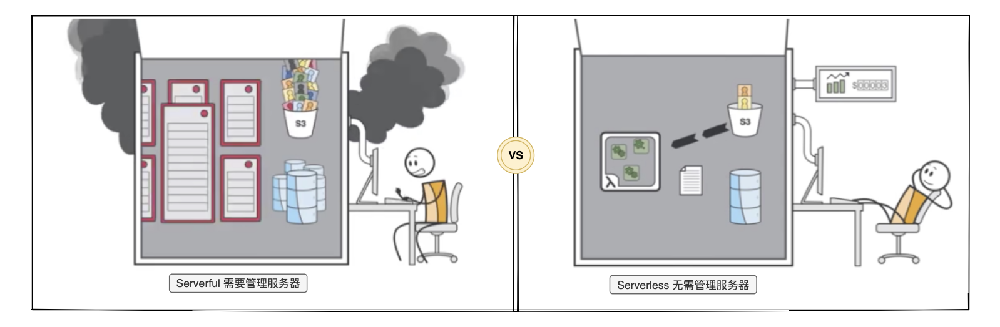

# Serverless 是什么

Serverless，又叫无服务器。Serverless 强调的是一种架构思想和服务模型，让开发者无需关心基础设施（服务器等），而是专注到应用程序业务逻辑上。Serverless 也是下一代计算引擎。

**Serverful vs Serverless：**

> Serverless 简化了云计算的编程，其代表了程序员生产力的又一次的变革，如编程语言从汇编时代演变为高级语言时代。-- 简化云编程：伯克利关于 Serverless 计算的观点

## Serverless，FaaS 和托管服务之间的关系

Serverless 与 FaaS（函数即服务）通常被视为可以互换的术语，但这并不准确。Serverless 是一种抽象层次更高的架构模式，而**“FaaS + BaaS”只是 Serverless 这种架构模式的一种实现**。

其中，FaaS 是一种特定类型的服务，例如 AWS Lambda，Google Cloud Functions，Azure Functions，阿里云函数计算和腾讯云函数等等；而 BaaS（后端即服务）可以理解为其他类型的托管服务，例如数据库服务，对象存储服务和日志服务等等。

## Serverless 具有的特质

这里叫特质，而非特性，因为这些属于 Serverless 架构的固有元素，我们无法像处理其它可塑特性那样做出调整。而特质是天然存在的。

- **免运维：**不需要管理服务器主机或者服务器进程。
- **弹性伸缩：**根据负载进行自动规模伸缩与自动配置。伸缩范围零到无穷大。
- **按需付费：**根据使用情况决定实际成本。
- **高可用：**具备隐含的高可用性。

## 相关链接

- [Malagu 是基于 TypeScript 的 Serverless First、组件化、平台无关的渐进式应用框架](https://github.com/cellbang/malagu)
- [[译]简化云编程：伯克利关于Serverless计算的观点](https://zhuanlan.zhihu.com/p/76180907)
- [What is Serverless Architecture? What are its Pros and Cons?](https://hackernoon.com/what-is-serverless-architecture-what-are-its-pros-and-cons-cc4b804022e9)
- [Knative](https://cloud.google.com/knative/)
- [Martin Folwer on serverless architectures](https://martinfowler.com/articles/serverless.html)

