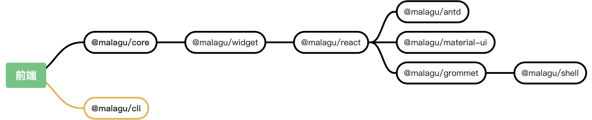
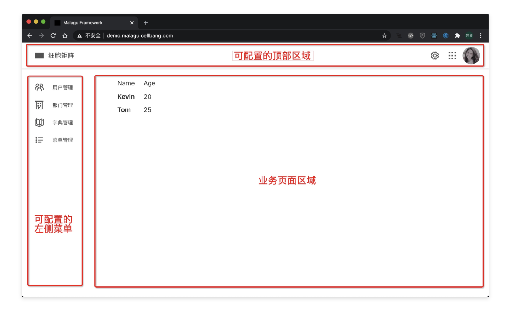
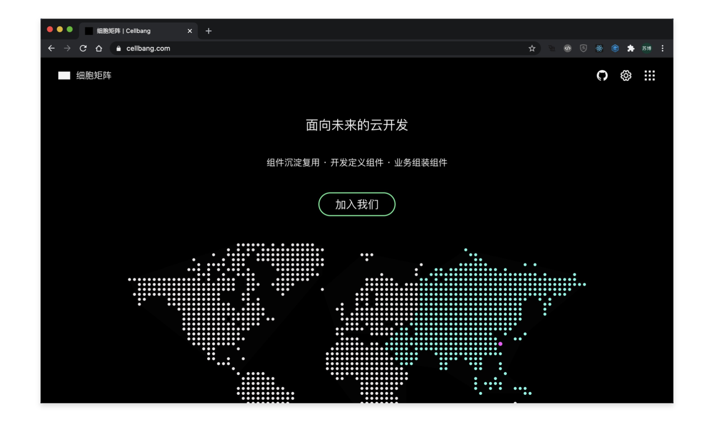

# React 开发

Malagu 框架是前端框架不绑定的，我们可以使用任意流行的前端框架。目前，框架对 React 框架集成度最好，提供了一个相对完整的解决方案。国际化、主框架布局、Widget 实现、路由定义、主题和多款前端 UI 框架等等开箱即用的能力。React 开发相关组件依赖情况如下：




## 如何开始


Malagu 命令行工具提供了一些列的应用开发模板，我们不需要完全从零开始创建项目。基于模块快速创建项目，然后再根据情况增减相关组件。模板内提供示例代码，让我们快速学习上手。


```bash
$ malagu init -o project-name # 基于模板初始化项目，并知道项目名称
```


## 选择 UI 框架


目前，框架提供三款 UI 框架的集成：antd、material ui 和 grommet。我们可以根据自己的喜好选择任意一款。如果您想集成其他 UI 框架，可以参考现有集成方案，集成工作比较简单。未来，Malagu 框架也会去集成越来越多的前端 UI 框架。


## 路由


框架对 React 集成提供新的路由定义方式，当然，我们仍然可以使用传统路由定义方式。使用新的路由定义方式的益处：

- 路由定义与路由组件定义在一处，增加代码的可读性
- 路由离散式定义，方便路由拆分到不同 Malagu 组件


**使用 `@View` 定义路由**
**
```typescript
// 形式一 
@View('/page1')
export class Page1 extends React.Component { ... }  

// 形式二 
function Page1() { ... }
@View({ path: '/page1', component: Page1 }) 
export default class {}  
```


**传统方式定义路由**
**
**
```typescript
@Router()
export class RouterImpl extends React.Component {
    render() {
        return (
            <Router history={history}>
                <Switch>
                    ...
                </Switch>
            </Router>
        );
    }
}
```


## 路由前缀配置
**
如果我们的前端路由存在一个统一的路由前缀，我们可以通过配置前端路由前缀来避免在每个路由上书写同样的路由前缀。具体配置如下：


```yaml
frontend:
  malagu:
    react:
      path: /xxx
```


## 路由 History 配置


框架默认的 History 类型为 browser，我们也可以通过属性覆盖的方式设置其他类型的 History。自定义 History 类型如下：


```yaml
frontend:
  malagu:
  	react:
      router:
        type: hash
```


## 路由关联布局
**
路由定义告诉 React 如何根据浏览的路由渲染 React 的页面组件，但是业务往往存在很多共性的东西，我们在实际的业务项目开发中，我们会这些共性的东西抽取到一个或多个布局组件中去，将页面中差异的部分作为布局组件的子节点渲染。当然布局组件之间也可以相互嵌套。如果你采用传统方式定义路由，此时，布局的写法与传统并没有什么区别。


```typescript
// 视图关联一个简单布局组件
@View({ path: '/page1', layout: Layout })
export class Page1 extends React.Component { ... }

function Layout() {
...
}

```


## 默认关联布局
**
当我们的视图页面没有设置布局时，视图页面会渲染到一个默认的布局组件，默认布局组件是空的布局组件，什么事情都没有做。在真实的业务中，往往大部分页面都会复用同一个布局组件，我们可以通过如下自定义默认布局组件：


```typescript
@DefaultLayout()
export class DefaultLayout extends React.Component<{}, {}> {
    render() {
        return <React.Fragment>{this.props.children}</React.Fragment>;
    }
}
```


如果我们想让某个视图页面不渲染到默认布局，可以如下设置：


```typescript
import { View, EmptyLayout } from '@malagu/react';

@View({ path: '/page1', layout: EmptyLayout })
export class Page1 extends React.Component { ... }
```


## React 上下文


通过 @View 定义路由，路由组件将托管给框架负责创建，这种情况下，我们如何在路由组件外包裹上下文组件呢？我们可以通过如下方式注入上下文组件：


```typescript
import * as React from 'react';
import { Context } from '@malagu/react';
import { ThemeProvider as Provider, THEME_REACT_CONTEXT_PRIORITY } from './theme-protocol';
import { ThemeProvider } from '@material-ui/core';
import { Autowired } from '@malagu/core/lib/common/annotation/detached';
@Context()
export class ThemeContext extends React.Component {
    static priority = THEME_REACT_CONTEXT_PRIORITY; // 上下文组件包裹的优先级
    @Autowired(Provider)
    protected readonly provider: Provider;
    render(): React.ReactElement {
        const { children } = this.props;
        return (
            <ThemeProvider theme={this.provider.provide()}>
                {children}
            </ThemeProvider>);
    }
}
```


其中，静态属性 priority 用来定义上下文组件包裹的优先级，因为我们可以定义多个上下文组件。


## Widget 与插槽


在 Malagu 后端开发，我们把后端几乎所有的对象都托管给 IoC 容器管理。好处是可以让我们的代码实现解耦，便于替换和扩展。我们可以通过 IoC rebind 能力，无侵入式替换任意默认实现。IoC 容器让框架变得更易扩展。既然前端开发也使用了 IoC 容器，如何将 IoC 容器的扩展能力引入到前端领域呢？通过 Widget 把前端组件注入到 IoC 容器，通过插槽组件把 IoC 容器中合适的 Widget 注入其他前端组件中。这样，我们就可以像后端一样，无侵入式地扩展前端组件能力。**我们可以选择 React 组件实现 Widget，Widgt 是前端框架无关的。**Widget 前端开发哲学：**Widgt 嵌套 Widget，Widget 组成页面，页面形成应用。**


#### 定义 Widget


定义 Widget 的方式有很多种：配置文件定义、数据库记录定义、装饰器定义等等。以下是装饰器定义 Widget 方式：
```typescript
import * as React from 'react';
import { ConfigUtil } from '@malagu/core';
import { Widget } from '@malagu/widget';
import { AreaType } from '../area';
import { NavItemProps, NavItem } from '@malagu/grommet';
import { Icon } from '@malagu/grommet';

export function Logo(props: NavItemProps) {
    const { label, icon, ...rest } = ConfigUtil.get('malagu.shell.logo');
    props = { ...rest, ...props };
    return (<NavItem size="medium" gap="xsmall" label={label} icon={<Icon icon={icon}/>} hoverIndicator={false} activatable={false} {...props}/>);
}

@Widget({ area: AreaType.TopLeftArea, component: Logo, priority: 1000 })
export default class {}
```


#### 使用插槽注入 Widget


插槽的实现与具体的前端框架耦合，这样可以提供机制的开发体验。
```typescript
import * as React from 'react';
import { Box, Nav, BoxProps } from 'grommet';
import { ConfigUtil } from '@malagu/core';
import { AreaType } from '../area-protocol';
import { Slot } from '@malagu/react';
import { Widget } from '@malagu/widget';

export function TopArea(props: BoxProps) {
    props = { ...ConfigUtil.get('malagu.shell.topArea'), ...props };

    return (
        <Nav direction="row" pad={{ vertical: 'small', horizontal: 'medium' }} elevation="xsmall" justify="between" {...props}>
            <Box direction="row" gap="small">
                <Slot area={AreaType.TopLeftArea} />
            </Box>
            <Box direction="row" gap="small">
                <Slot area={AreaType.TopRightArea} />
            </Box>
        </Nav>
    );
}

@Widget({ area: AreaType.TopArea, component: TopArea })
export default class {}
```


#### 替换 Widget 实现


通过同名注入 `id` 的 rebind 方式，可以很方便替换掉某个 Widget。也可以给某个区域注入一个新的 Widget。以下是同名替换示例：
```typescript
import * as React from 'react';
import { ConfigUtil } from '@malagu/core';
import { Widget } from '@malagu/widget';
import { AreaType } from '../area';
import { NavItemProps, NavItem } from '@malagu/grommet';
import { Icon } from '@malagu/grommet';

export function LogoExt(props: NavItemProps) {
    const { label, icon, ...rest } = ConfigUtil.get('malagu.shell.logo');
    props = { ...rest, ...props };
    return (<NavItem size="medium" gap="xsmall" label={label} icon={<Icon icon={icon}/>} hoverIndicator={false} activatable={false} {...props}/>);
}

@Widget({id: Logo, area: AreaType.TopLeftArea, component: LogoExt, rebind: true })
export default class {}
```
#### 
#### 通过 Malagu 组件属性配置 Widget


使用 `@Widget` 定义 Widget，如果没有指定 `id` 属性，则使用组件类或函数作为注入 `id` ，使用组件类或函数名称作为 Widget 的 `id` ；如果指定了 `id` 属性，则使用该 `id` 作为注入`id` ，使用该 `id` 的字符串值作为 Widget 的 `id` 。我们可以使用 widget 的 `id` 在 Malagu 组件配置文件中配置 Widget，改变原有 Widget 的组件样式、可见性、注入的区域等等。
```yaml
frontend:
  malagu:
    widget:
    	widgets:
      	Logo:
          visible: true
          area: TopLeftArea
          props:
          	size: large
            icon: Apps red small
```
## 
#### 使用 Widget Model 


Widget Model 是对 Widget 的元数据结构抽象，我们可以将 Widgt Model 存储在文件系统中，也可以将 Widgt Model 存储在数据库中。Widget Model 是前端框架无关的，任何前端框架的组件都可以使用 Widgt Model 来描述。Widget Model 通过 Widget 工厂生产 Widget。Widget Model 让可视化开发变得更加容易，且统一。框架默认的提供的 Malagu 组件属性来配置 Widget Model： `malagu.widget.widgets` 。


```yaml
frontend:
  malagu:
    widget:
    	widgets:
      	LoginButton:
        	type: Button
          area: TopRightArea
          props:
          	size: large
            label: 登录
```
## 
## React 开启 CDN


有时候，我们不希望 React 模块与前端业务代码打包到一起，而是希望通过 CDN 的方式加载 React 相关的代码或者样式，我们可以通过开启 CDN 加载实现。
**
#### 开启方式


在 Malagu 框架中，我们可以很容易开启 CDN 加载。方式如下：


- 在项目 malagu.yml 文件中配置 mode 属性


```yaml
mode: cdn #
# 有多个 mode 情况下
mode:
  - cdn
  - xxx
```


- 通过命令行选项指定 mode


```bash
$ malagu deploy -m cdn
# 有多个 mode 情况下
$ malagu deploy -m cdn,xxx
```
**
#### 实现原理


在组件 @malagu/react 中，提供了两个配置文件 malagu.yml 和 malagu-cdn.yml，默认情况下，只会加载 malagu.yml，该配置不会开启 CDN 加载，当指定 mode 为 cdn 时，按照 Malagu 配置文件加载规则，就会加载 malagu-cdn.yml 配置文件，该配置开启了 CDN 加载。malagu-cdn.yml 内容如下：


```yaml
frontend:
  malagu:
    webpack:
      config:
        externals:
          react: React
          react-dom: ReactDOM
      htmlWebpackTagsPlugin:  # EL 表达式的目的是为了本地开发调试
        react: "https://cdn.jsdelivr.net/npm/react@^16.12.0/umd/react.${cliContext.dev ? 'development' : 'production.min'}.js"
        react-dom: "https://cdn.jsdelivr.net/npm/react-dom@^16.12.0/umd/react-dom.${cliContext.dev ? 'development' : 'production.min'}.js"
```


如果您想替换默认的 CDN 加载地址，配置如下：


```yaml
# 在项目的 malagu.yml 文件中配置
frontend:
  malagu:
    webpack:
      htmlWebpackTagsPlugin:
        react: xxxxxxx
        react-dom: xxxxxxx
```


## 状态管理


React 在社区上有很多状态管理的工具，在使用 Malagu 框架开发，无论前端，还是后端，我们都使用一套 IoC 来开发，基于 IoC 的前端开发，我们更加推荐使用 [rxjs](https://www.npmjs.com/package/rxjs) 来管理状态。当然，我们也可以选在其他方案管理状态。


```typescript
import * as React from 'react';
import { Context } from '@malagu/react';
import { THEME_REACT_CONTEXT_PRIORITY } from './theme-protocol';
import { Grommet, grommet, ThemeType } from 'grommet';
import { ThemeManager } from '@malagu/widget';
import { ContainerUtil } from '@malagu/core';

export function ThemeContext({ children }: React.PropsWithChildren<{}>) {
    const themeManager = ContainerUtil.get<ThemeManager<ThemeType>>(ThemeManager);
    const [theme, setTheme] = React.useState(themeManager.currentSubject.value?.props);
    React.useEffect(() => {
        const subscription = themeManager.currentSubject.subscribe(t => setTheme(t?.props));
        return () => subscription.unsubscribe();
    }, []);

    return (
        <Grommet theme={theme || grommet}>
            {children}
        </Grommet>);
}

ThemeContext.priority = THEME_REACT_CONTEXT_PRIORITY;

@Context(ThemeContext)
export default class {}

```


## 国际化


框架通过集成 [react-intl](https://www.npmjs.com/package/react-intl) 实现国际化，并且提供了一个组件属性配置国际化 `malagu.locales` 。另外，框架往往也会提供语言切换的 React 组件，在您的页面中直接使用该组件就拥有了切换语言的能力。


```yaml
frontend:
  malagu:
    locales:
      zh-CN:
        messages:
          malagu.shell.login.label: 登录
          malagu.shell.logo.label: 细胞矩阵
    	en-US:
        messages:
          malagu.shell.login.label: Login
          malagu.shell.logo.label: Cellbang
```
## 主题


主题具体配置形式可能与选择的 UI 框架有一定关系，总体上是差不多的，框架同样也提供了一个组件属性配置主题 `malagu.themes` 。另外，框架往往也会提供主题切换的 React 组件，在您的页面中直接使用该组件就拥有了切换主题的能力。以下代码以 `grommet` 框架为例：


```yaml
frontend:
  malagu:
	  themes:
      default:
        label: 黑色
        props:
          global:
            colors:
              brand: '#000000'
      blue:
        label: 蓝色
        props:
          global:
              colors:
                brand: '#7D4CDB'
      green:
        label: 绿色
        props:
          global:
            colors:
              brand: '#00C781'
      yellow:
        label: 黄色
        props:
          global:
            colors:
              brand: '#FFCA58'
```


## 主框架布局


从我们日常开发的应用中，可以发现大部分应用的主框架布局是差不多的，比如顶部是应用导航菜单，导航菜单上会有应用的图标和名称，以及其他一些工具按钮等等。对于后端管理系统，左边区域可能是菜单列表或者菜单树。


我们希望基于 Malagu 组件机制、Widget 机制提供的扩展和组合能力，实现一些经典的主框架布局，且这些主框架布局开箱即用。主框架布局每一个区域都可以扩展，扩展方式：Malagu 组件属性配置、IoC 容器 rebind 替换或插入新的 Widget、使用插槽自行组装主框架布局等等。






#### 自定义应用 Logo


其他功能的配置类似，以下是自定义应用 Logo 相关的信息：
```yaml
malagu:
  shell:
    logo:
      label: malagu.shell.logo.label # 国际化相关的 Key
      icon: Cellbang
      path: /
```


#### 自定义功能菜单


```yaml
malagu:
  widget:
    widgets:
      test:
        type: NavItem
        area: Nav
        props:
          path: /users
          icon: Group
          label: 用户管理
      test2:
        type: NavItem
        area: Nav
        props:
          path: /depts
          icon: Organization
          label: 部门管理
      test3:
        type: NavItem
        area: Nav
        props:
          path: /dictionaries
          icon: Catalog
          label: 字典管理
      test4:
        type: NavItem
        area: Nav
        props:
          path: /menus
          icon: List
          label: 菜单管理
```


#### 自定义应用中心


```yaml
malagu:
  shell:
    categories:
      appCenter:
        name: 应用中心
    apps:
      authentication:
        name: 云认证
        icon: Shield
        categoryId: appCenter
      accessControl:
        name: 云授权
        icon: Validate
        categoryId: appCenter
      development:
        name: 云开发
        icon: Code
        categoryId: appCenter
      configuration:
        name: 云配置
        icon: SettingsOption
        categoryId: appCenter
      monitor:
        name: 云监控
        icon: Monitor
        categoryId: appCenter
```
## 工具类


PathResolver：根据路由计算完整路由，会基于路由前缀来计算。


