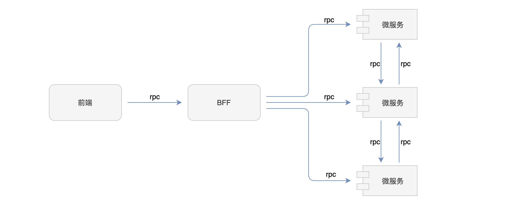

# 微服务

当我们着手开发一个新项目的时候，单体和微服务架构该如何抉择？对于创业团队来说，更倾向于先采用单体架构来试错，商业模式验证成功后，再根据业务规模的增涨逐渐演进到微服务架构，从而解决单体架构带来的臃肿、可维护性等等问题。


目前，微服务的落地方案有很多，也相当成熟，比如像 Spring Cloud、Dubbo 等等的微服务框架。而 Cell 提供的微服务解决方案是 Serverless 优先的，更加贴合 Serverless 场景。Serverless 让微服务框架的实现变得更加轻量，框架的使用更为简单，而当我们在使用传统微服务框架部署在 Serverless 平台上的时候，我们会发现传统微服务框架过于臃肿，很多在传统服务器架构上很有用的功能，被 Serverless 底层给实现并透明掉了，让开发者无需关心。比如服务注册与发现、健康监控、日志、运维等等。


## 特征


Cell 框架提供的微服务解决方案有如下特征：

- **轻量级：** 没有依赖第三方微服务模块
- **简单：** 与普通后端服务开发风格保持一致，开箱即用，零学习成本
- **平滑切换：** 单体无缝切换为微服务
- **统一：** 前端与 BFF、BFF 与 微服务，微服务与微服务采用统一的 [JSON RPC](https://www.jsonrpc.org/specification) 通信协议
- **Serverless 优先** 


## 调用关系图



## 初始化微服务项目


Cell 框架提供了一个微服务开发模板 `microservice` ，基于该模板，我们可以快速初始化一个微服务项目，当然，我们也可以创建 monorep 风格的项目，管理多个微服务项目，可以选择模板 `multi-component` 。初始化微服务项目命令如下：
```bash
# 初始化一个项目名称为 user-service 的微服务项目
cell init microservice -o user-service
```
微服务项目目录结构如下：
```
.
├── README.md
├── cell.yml                   # 配置文件
├── package.json
├── src
│   ├── common
│   │   └── welcome-protocol.ts  # 接口定义
│   └── node
│       ├── module.ts            # 模块定义
│       └── welcome-server.ts    # 接口实现
└── tsconfig.json
```


## 开发微服务


1. 定义接口：
```typescript
// 方式一
export const WelcomeServer = 'WelcomeServer';
// 方式二
// export const WelcomeServer = Symbol('WelcomeServer');

export interface WelcomeServer {
    say(): Promise<string>;
}
```

2. 实现接口
```typescript
import { WelcomeServer } from '../common/welcome-protocol';
import { Rpc } from '@celljs/rpc';

@Rpc(WelcomeServer)
export class WelcomeServerImpl implements WelcomeServer {
    say(): Promise<string> {
        return Promise.resolve('Welcome to Cell');
    }
}
```


## 调用微服务

**方式一：** 使用配置文件定义微服务端点

```typescript
import { WelcomeServer } from 'user-service/common/welcome-protocol';
import { Autorpc } from '@celljs/rpc';
import { Component } from '@celljs/core';

@Component()
export class A {
    @Autorpc(WelcomeServer)
  	protected welcomeServer: WelcomeServer;
  	say(): Promise<String> {
        return this.welcomeServer.say();
    }
}
```
定义微服务端点：
```yaml
cell:
  rpc:
    endpoint:  # endpoint 的 key 需要与 @Autorpc 参数的字符串值保持一致
      WelcomeServer: http://abc.com/api/WelcomeServer # 若以方式二定义接口: http://abc.com/api/Symbol(WelcomeServer)
```
**方式二：** 在 `@Autorpc()` 参数中直接定义微服务端点

```typescript
import { WelcomeServer } from 'user-service/common/welcome-protocol';
import { Autorpc } from '@celljs/rpc';
import { Component } from '@celljs/core';

@Component()
export class A {
    @Autorpc('http://abc.com/api/WelcomeServer')
    // 若以方式二定义接口: @Autorpc('http://abc.com/api/Symbol(WelcomeServer)')
  	protected welcomeServer: WelcomeServer;
  	say(): Promise<String> {
        return this.welcomeServer.say();
    }
}
```


## 微服务端点规则


使用 Cell 开发的微服务的端点规则为：[**域名**]/[**路由前缀**]/[**RPC 前缀]**/[**服务标识**]。其中：

- 默认路由前缀（cell.server.path）为 `/` 
- 默认 RPC 前缀（cell.rpc.path）为 `api` 
- 服务标识一般定义为接口名称，比如 `WelcomeServer` 


## 微服务端点占位符


如果使用 Cell 框架开发的微服务，端点的格式是统一的，为了简化微服务端点的配置，框架提供了两个占位符：

- `{rpcPath}` 表示的值为：[**路由前缀**]/[**RPC 前缀]**
- `{erviceIdentifier}`  表示的值为 [**服务标识**]


在微服务调用的方式一中，配置文件还可以如下配置：
```yaml
cell:
  rpc:
    endpoint:  # endpoint 的 key 需要与 @Autorpc 参数的字符串值保持一致
      WelcomeServer: http://abc.com{rpcPath}/{serviceIdentifier}
```
使用默认端点进一步简化配置：
```yaml
cell:
  rpc:
    defaultEndpoint:  http://abc.com{rpcPath}/{serviceIdentifier} # 只要你的微服务部署在同一个域名下
```


## 微服务认证


Cell 框架提供了一个接口 `ClientConfigProcessor` ，该接口定义如下：
```typescript
import { AxiosRequestConfig } from 'axios';

export const ClientConfigProcessor = Symbol('ClientConfigProcessor');

export interface ClientConfigProcessor {
    process(config: AxiosRequestConfig): Promise<void>;
}
```
框架把 HTTP 请求的配置参数传递给该接口的实现，通过该接口的实现，我们可以自定义 HTTP 请求配置参数，从而把我们的认证信息带上。


如果我们采用的是简单认证，框架提供了一个配置属性 `cell.rpc.client.config` 。配置示例如下：
```yaml
cell:
  rpc:
    client:
      config:
        auth:
          username: abc
          password: 123
```
除了上面的配置属性， `AxiosRequestConfig` 的其他属性都可以通过 `cell.rpc.client.config` 配置。


## 请求合并


无论是前端与后端，还是后端与后端之间的 RPC 调用，都支持请求合并。请求合并在高并发情况下，会有较大的性能优化，提供应用对高并发场景的更好支持。同时，因为请求合并，大大减少了请求数量，从而减弱了网络延迟的影响。另外，在 Serverless 场景下，请求合并，可以极大减少冷启动的概率，尤其对那些云厂商不支持单实例多请求情况更为有效。如果我们的并发度很低，不建议开启请求合并功能。


请求合并功能默认是关闭的，我们可以通过配置文件开启，配置如下：
```yaml
cell:
  rpc:
    merge:
      enabled: true
```
其他配置：
```yaml
cell:
  rpc:
    merge:
      timerDelay: 35 # 35ms
      maxLength: 5242880 # 5MB
      maxCount: 100
```

- `timerDelay` 请求时间延迟，默认为 35 毫秒，会推迟首个请求发送时间，从而等待其他请求进行合并
- `maxLength` 请求合并的最大请求体内容长度，默认为 5MB，当请求体内容长度即将超过最大长度时，就算时间延迟还没到，也会提前发送合并的请求。该配置对 Serverless 场景很友好，大部分 Serverless 平台限制大小请求体内容长度为 6 MB，所有该最大长度配置最好不要超过 6 MB
- `maxCount` 最大请求合并的个数，默认为 100 个
