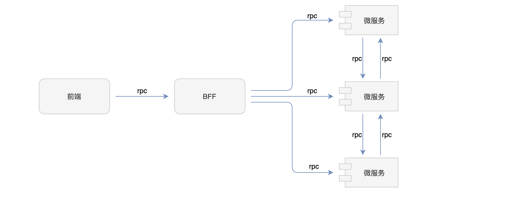

# 微服务应用

我们可以使用 Malagu 框架开发微服务的应用，微服务可以应用使用 RPC 风格的接口，也可以使用 REST 风格的接口（推荐使用 RPC 风格的接口，这样可以充分利用框架给我们提供的便利性）。如果我们采用 RPC 风格开发微服务，不同微服务之间的调用，就像调用本地方法一样简单。这样的话，前端与后端、微服务之间都可以采用统一 RPC 方式进行通信。更多有关微服务的介绍，请阅读[微服务](https://malagu.cellbang.com/dev/%E5%BE%AE%E6%9C%8D%E5%8A%A1)。



## 快速开始


Malagu 框架提供了命令行模板，我们可以通过 `malagu init` 命令快速创建一个微服务应用项目。选择如下模板：
```bash
➜  test malagu init

                   ___
 /'\_/`\          /\_ \
/\      \     __  \//\ \      __       __   __  __
\ \ \__\ \  /'__`\  \ \ \   /'__`\   /'_ `\/\ \/\ \
 \ \ \_/\ \/\ \L\.\_ \_\ \_/\ \L\.\_/\ \L\ \ \ \_\ \
  \ \_\\ \_\ \__/.\_\/\____\ \__/.\_\ \____ \ \____/
   \/_/ \/_/\/__/\/_/\/____/\/__/\/_/\/___L\ \/___/
                                       /\____/
                   @malagu/cli@2.30.0  \_/__/

╭──────────────────────────────────────────────────╮
│      Serverless First Development Framework      │
╰──────────────────────────────────────────────────╯

? Select a template to init
  vue-app Official
  database-app Official
  accounts Official
  schedule Official
  admin-app Official
❯ microservice Official
  standalone-app Official
  file-service Official
  puppeteer Official
  mycli Official
  backend-app Official
  sample-app Official
(Move up and down to reveal more choices)
```
## 示例代码


[在线打开示例代码](https://cloud.cellbang.com/?share=1fbef12f-bfa6-4378-a318-48607052c637#/templates/microservice)

