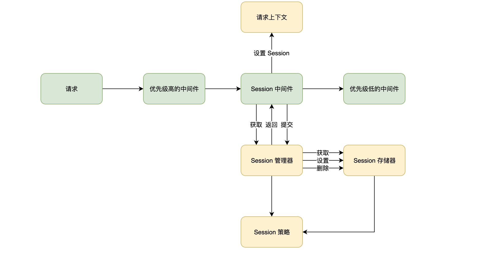

# Session 管理

Session 管理是比较复杂，Malagu 框架并没有提供一颗银弹解决任何复杂的业务场景，但提供了一套高度抽象的可扩展模型来满足大部分业务场景，特殊的场景可以通过框架提供的扩展点很方便的进行扩展。


## 设计图


## Session 定义


```typescript
export interface Session {
    id: string;
    isNew: boolean;
    expire: number;
    maxAge: number;
    readonly changed: boolean;
    [key: string]: any;
    toJSON(): any;
}
```


## Session 中间件


Session 默认存储器是基于 Cookie 实现，所以 Session 中间件的优先级必须比 Cookie 中间件低。当我们需要在自定义的中间件中获取 Session，我们必须设置该中间件的优先级低于 Session 中间件。


## Session 管理器


Session 管理器实现一般情况下不需要扩展，Malagu 框架已经把 Session 管理器部分可能经常变的逻辑抽象到了 Session 存储器和 Session 策略之中，我们可以通过实现自己的 Session 存储器和 Session 策略来满足业务需求。


```typescript
export interface SessionManager {

    get(): Promise<Session>;
    remove(): Promise<void>;
    commit(): Promise<void>;
}
```


## Session 存储器


Malagu 框架默认提供了基于 Cookie 存储的 Session 存储器，用户也可以实现基于 Redis 存储的 Session 存储器。


```typescript
export interface SessionStore {
    get(id: string): Promise<Session | undefined>;
    set(session: Session): Promise<void>;
    remove(id: string): Promise<void>;
}
```


## Session 策略


框架把 Session 管理中可能变得部分抽象为了 Session 策略，Session 策略主要用来验证 Session 对象的有效性、如何创建一个 Session 对象、报错 Session 对象的时机。


```typescript

export interface SessionStrategy {
    valid(session: Session): Promise<boolean>;
    create(obj?: any): Promise<Session>;
    shouldSaveSession(session: Session): Promise<boolean>;
}
```


## Session 配置属性


```yaml
malagu: 
  session: 
    autoCommit: true                  # 自动提交保存已经变更过的 Session，为 false，则需要手动提交
    maxAge: 86400000                  # Session 对象有效时间
    sessionIdKey: malagu:sessionId    # 获取或者存储 Session 对象 Id 的 Key
    sessionKey: malagu:session        # 获取或者存储 Session 对象 的 Key
    renew: false                      # Session 对象快要过期的时候进行是否应该保存
```


