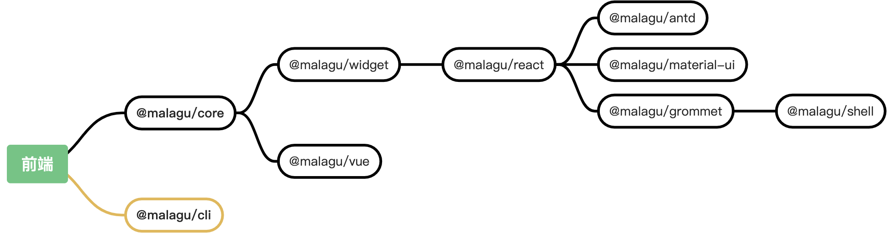

# 前端架构

Cell 是一个渐进式应用开发框架，由一些列组件构成，随着框架的不断发展，会有越来越多的组件。组件机制是对通用可组合能力的一种抽象，组件机制不局限于某一种类型的应用。

得益于 Typescript 既能开发后端应用，也用开发前端应用，让前后端空前统一。Cell 框架在前后端融合、全栈开发这些方面做了很多深入地思考。如何让**前后端都可以采用同一套开发框架实现**，且又能保证框架的简单和灵活是一件很有挑战的事。

## 渐进式前端开发

**在 Cell 的世界里，一切皆组件，应用也是一个组件，是一个根组件。**组件的组合形成我们的应用，这个应用可以是纯前端应用、纯后端应用和前后端一体化应用。不同应用类型之间可以很平滑的互相演变。

就像后端开发一样，Cell 框架也提供了一些列的前端组件，以及一些前后端通用组件，基于这些组件，我们能很容易的渐进式开发前端应用。**前端组件就是为了封装通用能力而简化前端开发、复用框架底层基础设施（IoC 能力等）而统一前后端开发体验。**

Cell 提供的前端能力更像 Angular，是一套完整的前端工程化解决方案。前端应用未来需要的通用能力都以组件的形式提供好了。**根据实际情况，选择我们需要的组件，不用担心 Cell 提供的能力过多，而导致一个简单的应用也会比变得臃肿。**

## 前端框架不锁定

目前，开源社区有很多流行的前端框架，如 React、Vue 和 Angular 等。这些前端框架已经足够优秀了，社区群体也特别大，我们完全没有必要自己研发一套新的前端框架，一方面增加不必要的研发成本；另一方面增加额外的学习成本。关键是未必比现有的前端框架好用。

我们应该选择哪一个现有的前端框架呢？我们无需选择。得益于 Cell 框架组件机制，我们能够很容易让框架支持任意流行的前端框架，只需要针对每一个前端框架提供相应的一个组件即可。我们想用什么前端框架就依赖对应的组件。
**
**正是因为组件机制带来的渐进式能力，让各式各样复杂的业务场景切分成一个个可组合的单元能力，通过单元组合、分化适配任意业务场景。**
**
## 现阶段框架拥有的能力
**
现阶段，Cell 提供了 Widget、React、Vue 等相关的一系列组件，包含了国际化、主题、路由简化、通用主框架布局和各种前端 UI 框架的集成（开箱即用）等等能力。

