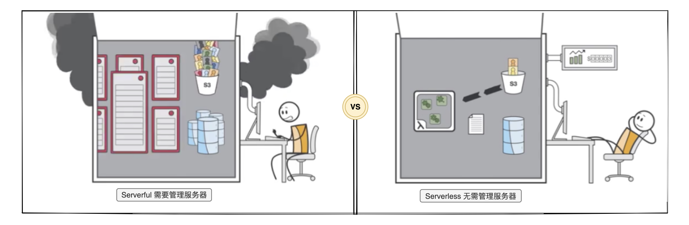

## 一、IoC 和依赖注入


Malagu 框架中大量使用了 IoC 和依赖注入，在使用 Malagu 框架的时候，不可避免会使用到 IoC 和依赖注入。如果您以前没有接触过 IoC 和依赖注入，本篇文档将带您了解什么是 IoC 和依赖注入？为什么我们需要它。如果您在其他框架中已经接触过，可以跳过。


### 什么是 IoC 和依赖注入
**
**控制反转**（Inversion of Control，缩写为**IoC**），是[面向对象编程](https://link.zhihu.com/?target=https%3A//zh.wikipedia.org/wiki/%25E9%259D%25A2%25E5%2590%2591%25E5%25AF%25B9%25E8%25B1%25A1%25E7%25BC%2596%25E7%25A8%258B)中的一种设计原则，可以用来减低计算机代码之间的[耦合度](https://link.zhihu.com/?target=https%3A//zh.wikipedia.org/wiki/%25E8%2580%25A6%25E5%2590%2588%25E5%25BA%25A6_%28%25E8%25A8%2588%25E7%25AE%2597%25E6%25A9%259F%25E7%25A7%2591%25E5%25AD%25B8%29)。其中最常见的方式叫做**依赖注入**（Dependency Injection，简称**DI**），还有一种方式叫“依赖查找”（Dependency Lookup）。


IoC 是面向对象编程的一种设计原则。所有它与具体框架和 java 无关，只要你用的开发语言支持面向对象编程就需要它。所有你会发现 go、php、java、js 等等语言都会存在 IoC 相关的框架或者库。


### 为什么我们需要 IoC


对象的创建托管给 IoC，可以解耦，也让 [AOP](https://www.yuque.com/cellbang/malagu/agvzcl) 这样能力得以方便实现。一个普通项目中，绝大部分的 bean 对象都是单例的，创建一个单例对象是简单的，但是创建一堆相互之间有依赖关系的单例对象是很复杂的。这时候 DI（依赖注入）就发挥作用了。DI 不仅仅解决复杂依赖关系自动构建，而且性能上也做了极致的优化。比如 DI 并不会在项目启动的时候创建所有对象实例，而是按照项目实际运行情况，按需创建和注入对象。


面向对象编程有一个很重要的原则是面向抽象编程，或者说依赖倒置。好处是接口是抽象不变的，而接口的实现是多样可变的。因为我们将对象托管给了 IoC，IoC 能让我们无侵入式地替换默认的实现。这对于开发框架和应用模块至关重要，因为只有这样，你的框架或模块才能更加容易实现低耦合，可扩展的能力。
你可能会想：我的业务项目不需要可扩展，甚至低耦合。但是你用的开发框架需要，所以你也需要，因为你需要通过 IoC 机制扩展框架的默认行为。（如何业务实在太简单了，不用当然也没问题，使用一个不带 IoC 能力的框架也不错）


其实，业务项目也是特别需要可扩展和低耦合的。因为我们不可能只开发一个单模块的业务项目，大部分情况我们需要开发多个业务项目，每个业务项目由多个模块组成，这时候你会发现，有些模块在多个项目之间可以复用，虽然存在些许差异。我们可以把差异抽象成通用接口，并提供常用的默认实现，在特殊场景下，可以提供自己实现，通过 IoC 替换掉默认实现。


虽然，我们做业务项目开发，但是我们也需要用开发框架的方式来开发我们的业务项目，这样你的业务项目才更具扩展性、低耦合、易维护。所以面向对象编程对抽象能力要求很高，我们要在业务当中不断发现可抽象的地方，让其沉淀为公司的知识资产。


_抽象最难的是如何把握这个度，过了这个度，就是过度设计了，过度设计很可怕，每个合格的程序员都会或多或少有过过度设计。过度设计是相对而言的。_


## 二、什么是面向切面编程 AOP


面向对象编程（OOP）和面向切面编程（AOP）都是一种编程方式，AOP 可以作为 OOP 的补充。为什么说是补充了，其实就是 OOP 在某些场景不好处理，而 AOP 却能很好处理。


无论是 AOP，还是 OOP，它们的目标是一致的：让代码变得易扩展和可读性强。


OOP 里面，我们主要通过继承和组合等方式提供扩展能力。当然，OOP 原则是让我们少用继承，多用组合。后面我会结合一个例子来说明原因。


AOP 也不例外，提供了一种新的扩展能力。继承的扩展对象是一个或多个类，Java 是单继承机制，只能对一个类进行扩展；而 AOP 扩展对象是切面，由不同类里面的一个或者多个方法组成。如果把类的继承看做纵向扩展，那么 AOP 就是一个横向扩展。到底是由哪些类的哪些方法来组成切面呢？这个就是由切点来描述。通过 AOP 实现的扩展代码，我们就叫它切面代码。


那么 AOP 可以理解为这样的一个过程：切点定位类中的一系列方法，多个切点组合成一个切面，切面代码实现了扩展的能力，最后将切面代码编织到切面中的所有切点里面去。（编织的时候，还有一个通知的概念被省略了，通知其实是用来描述切面代码编织到切点的时机）


**举例说明：一个非常经典的例子：事务的管理。**
**
很多服务类都需要编写事务管理相关的代码。怎么把这些重复的代码抽象出来呢？一种比较容易想到的方式是抽象一个父类，把这些相同的代码放到父类中，子类继承该父类，则自然拥有了父类的事务管理能力。


但是通过继承做抽象不是很优雅，因为继承对业务代码侵入性太强，业务代码不得不继承一个父类。像 Java 本身即是单继承机制，业务子类如果还相继其他的父类就会很麻烦了。这也是为什么 OOP 原则中有一条少用继承，多用组合的原因。


目前最好的方式是通过 AOP 抽象事务管理相关的代码。该方式对业务代码侵入性最小，只需要在类或者方法上加相关的注解，框架则自动将事务管理相关的代码编织到目标类的方法里面去。


## 三、Serverless 是什么

Serverless，又叫无服务器。Serverless 强调的是一种架构思想和服务模型，让开发者无需关心基础设施（服务器等），而是专注到应用程序业务逻辑上。Serverless 也是下一代计算引擎。


**Serverful vs Serverless：**



> Serverless 简化了云计算的编程，其代表了程序员生产力的又一次的变革，如编程语言从汇编时代演变为高级语言时代。-- 简化云编程：伯克利关于 Serverless 计算的观点

### Serverless，FaaS 和托管服务之间的关系


Serverless 与 FaaS（函数即服务）通常被视为可以互换的术语，但这并不准确。Serverless 是一种抽象层次更高的架构模式，而**“FaaS + BaaS”只是 Serverless 这种架构模式的一种实现**。


其中，FaaS 是一种特定类型的服务，例如 AWS Lambda，Google Cloud Functions，Azure Functions，阿里云函数计算和腾讯云函数等等；而 BaaS（后端即服务）可以理解为其他类型的托管服务，例如数据库服务，对象存储服务和日志服务等等。


### Serverless 具有的特质


这里叫特质，而非特性，因为这些属于 Serverless 架构的固有元素，我们无法像处理其它可塑特性那样做出调整。而特质是天然存在的。


- **免运维：**不需要管理服务器主机或者服务器进程。
- **弹性伸缩：**根据负载进行自动规模伸缩与自动配置。伸缩范围零到无穷大。
- **按需付费：**根据使用情况决定实际成本。
- **高可用：**具备隐含的高可用性。


### 相关链接


- [Malagu 是基于 TypeScript 的 Serverless First、组件化、平台无关的渐进式应用框架](https://github.com/cellbang/malagu)
- [[译]简化云编程：伯克利关于Serverless计算的观点](https://zhuanlan.zhihu.com/p/76180907)
- [What is Serverless Architecture? What are its Pros and Cons?](https://hackernoon.com/what-is-serverless-architecture-what-are-its-pros-and-cons-cc4b804022e9)
- [Knative](https://cloud.google.com/knative/)
- [Martin Folwer on serverless architectures](https://martinfowler.com/articles/serverless.html)


## 四、Serverless 价值

**对老板来说：**


- **按需付费**，资源利用率 100%，降低服务器资源成本。
- **免运维**，无需管理服务器，不需要或者需要更少的服务器运维人员。
- **减低创新成本**，通过缩短业务应用开发周期，快速响应变化的需求，不断创新。
- **降低用人成本**，无需为支持高可用高并发买单，对程序员的技能要求相对更低，减少企业用人成本。


简而言之，**对老板来说，Serverless 极大降低企业运营成本，加速业务创新的实现与验证。**
**​**

**对程序员来说：**


- **减低后端开发门槛**，因为无需关注服务器、高并发和高可用相关问题，让后端开发门槛降低
- **聚焦业务逻辑的实现**，而非基础设施（服务器）。
- **原来的后端开发者，做更有挑战的事情**，可以从事做更为后端的开发工作，或者成为全栈。
- **降低成为全栈开发者难度**，全栈程序员能够了解完整的业务逻辑，方便业务应用全链路优化，同时，也减少了前后端沟通成本。


简而言之，**对程序员来说，Serverless 极大降低了后端开发技术门槛，且无需关心服务器底层细节。这些改变，让程序员的 Scope 变得更大，且更有价值。不是像一个螺丝钉一样，而是一个人也能干一件完整的事，完全充分了解业务逻辑，方便做业务与技术融合的创新。**
[
](https://github.com/cellbang/malagu)


## 五、组件

**被用于运行时和应用程序的模块化功能。**Malagu 使用模块化设计，将功能作为组件来提供。一个应用随着业务的发展往往会变得越来越复杂和臃肿，不同应用之间又往往存在不同维度的共性。组件化能很好的解决上面的问题：

- 通过将复杂和臃肿的应用横向拆分成一个个业务组件
- 通过把存在共性的不同应用纵向提炼抽象成一个个基础组件


另外，Malagu 框架本身也是一个特别复杂的项目，Malagu 框架同样可以基于自身的组件机制来实现，让 Malagu 框架更具活力。
​

### 加载机制
​

Malagu 组件本质上就是一个 npm 包，我们只需要在一个普通的 npm 包的 `package.json` 文件的 `keywords` 属性中添加 `malagu-component` 关键字，则被 Malagu 的命令行工具识别为一个 Malagu 组件，Malagu 的命令行工具则按照组件的加载机制进行加载。其中，加载机制主要包含两部分：属性加载和模块加载。使用 Malagu 命令行工具加载，可以极大简化组件的组装，当然，我们也可以手动组装 Malagu 组件，这时候，`package.json` 中的 `keywords` 属性无需做任何配置了。
​

### 组件种类


Malagu 组件设计是一种高度抽象的设计，模型足够的简单。我们可以实现编译时组件，干预 Malagu 应用的运行、构建与部署。也可以开发前端、后端和前后端一体化组件。对于 Malagu 来说，不关心组件类型是什么，Malagu 有一套统一且简单的模型来抽象这一切。
​

### Core 组件


框架默认基础组件都在 `@malagu` npm 组织下，例如安装 Core 组件可以通过 `npm install  @malagu/core` 安装。Core 组件主要包含如下能力：

- 应用生命周期管理
- 依赖注入装饰器
- AOP 面向切面编程
- EL 表达式
- 属性配置管理
- 管道
- 日志管理
- 异常接口
- 工具类

​

其他组件一般是依赖 Core 组件，使用 Core 组件的依赖注入、日志、应用生命周期等相关能力。我们也推荐你这么做。
​

​

### Web 组件
​

Web 组件，即 `@malagu/web` ，依赖 Core 组件。Malagu 并非只是一个 Web 应用开发框架，我们可以使用Malagu 开发非 Web 应用类型，比如命令行工具、桌面应用等等。如果我们开发的是一个 Web 应用，Web 组件一般是必不可少。Web 组件对 Web 应用场景常用能力的抽象与封装。具体包含如下能力：

- 中间件（可以方便对接 Express 中间件）
- CORS 管理
- Cookie 管理
- Session 管理
- 链路追踪
- HTTP 协议接口（映射规则和请求处理器）
- 工具类

​

Web 组件只是偏底层的抽象，如果单独使用 Web 组件开发 Web 应用比较低效。所有我们一般情况下会与 Web 组件的子组件 MVC 组件和 RPC 组件结合在一起使用。

- MVC 组件，即 `@malagu/mvc`，基于 Web 组件的扩展接口，实现了一套装饰器风格的 REST API 定义方式
- RPC 组件，即 `@malagu/rpc`，基于 Web 组件的扩展接口，实现了一套 RPC 风格 API 定义方式

​

实际使用中，我们可以选择其中一种或者两种风格定义 API。当然，我们也可以直接扩展 Web 组件的接口，类似 MVC 组件和 RPC 组件，定义自己所需要的书写风格。
​

### 云组件


Malagu 是一个 Serverless Frist 应用开发框架，不仅体现在 Serverless 场景中的冷启动优化、数据库连接管理、Session 管理等等方面，还体现在 Malagu 应用对云计算资源的分层抽象与解耦，从而实现平台不锁定。而云组件，即 `@malagu/cloud`，是一个云计算资源的底层抽象以及云计算通用的能力，目的是为了屏蔽不同云厂商之间的差异。具体实现由子组件实现。其中，`@malagu/faas-adapter` 组件就是云组件的一个子组件，`@malagu/faas-adapter` 组件是对 FaaS 能力的抽象，属于第二层抽象，在它下面才是真正的具体实现，如 `@malagu/scf-adapter` 、`@malagu/fc-adapter` 、`@malagu/lambda-adapter` 、`@malagu/vercel-adapter` 和 `@malagu/express-adapter` 。这些具体实现就与具体的云厂商相关了。云组件主要包含一下能力：

- 各种云计算资源接口定义
- 云账号接口
- 地域接口
- 客户端配置选项

​

​

**更多基础组件介绍，请移步于**[**基础组件**](https://www.yuque.com/cellbang/malagu/hw7cz4)**。**

## 六、运行时

运行时是一个或或多个组件组成，以根组件形式存在，也就是 Malagu 应用。当我们创建一个 Malagu 应用的时候，其实就是创建了一种运行时。你可能已经发现了，当你在一个 Malagu 应用的根目录下执行 `malagu -h` 往往会多出来一个 `malagu config` 命令，其实，该命令是由 `@malagu/faas-adapter` 组件提供。默认情况会以当前命令行工作目录作为运行时目录。所有命令行工具才能正确加载当前应用中的组件，并动态扩展命令  `malagu config` 。
​

最开始，Malagu 不支持指定或者管理全局运行时，为了能让 Malagu 组件进一步提升一个维度的复用能力。Malagu 支持了管理全局运行时。也就是说，我们可以把多个组件的能力组合起来，以运行时的方式安装为全局运行时。从而实现开发语言无关。你可以定义一种运行时，开发者在使用时，可以完全不用关系 Malagu 组件的实现细节。
​

我们可以针对一些特定场景，提供特定的运行时，给用户提供极致的开发、部署体验。目前，Malagu 提供了一个内置运行时 `serve-static` ，通过它，我们可以一键运行、部署一个静态网站到云计算平台。操作步骤如下：

1. 安装运行时：`malagu runtime install serve-static`
1. 使用运行时：`malagu runtime use serve-static`
1. 进入静态网站文件根目录
1. 本地运行静态网站：`malagu serve`
1. 一键部署（第一次部署需要配置云账号 AKSK）：`malagu deploy`

​

Malagu 运行时管理更多操作如下：
​

```bash
                   ___
 /'\_/`\          /\_ \
/\      \     __  \//\ \      __       __   __  __
\ \ \__\ \  /'__`\  \ \ \   /'__`\   /'_ `\/\ \/\ \
 \ \ \_/\ \/\ \L\.\_ \_\ \_/\ \L\.\_/\ \L\ \ \ \_\ \
  \ \_\\ \_\ \__/.\_\/\____\ \__/.\_\ \____ \ \____/
   \/_/ \/_/\/__/\/_/\/____/\/__/\/_/\/___L\ \/___/
                                       /\____/
                   @malagu/cli@1.30.0  \_/__/

╭──────────────────────────────────────────────────╮
│      Serverless Frist Development Framework      │
│               Runtime<static-site>               │
╰──────────────────────────────────────────────────╯

Usage: malagu runtime [options] [command] [command] [command]

management runtime

Options:
  -h, --help                           display help for command

Commands:
  install [options] [runtime] [alias]  install a runtime
  use [runtime]                        use a runtime
  list                                 list all runtimes
  uninstall [runtime]                  uninstall a runtime
```

## 七、配置

在 Malagu 的世界里：“一切皆组件”。Malagu 应用也是一个组件，是根组件。根组件依赖一个或者多个基础组件。组件机制将应用与组件统一：一个或多个组件组合成更复杂的高阶组件，如果这个高级组件不再被其他组件复用，则该组件本质上就是一个应用。
​

组件本质上是 npm 包，在 npm 包之上多出了属性和模块概念。其中，属性就是扩展组件的一种常用的扩展机制。属性配置是一种无需写任何代码就能实现扩展的方式。
​

在 Malagu 组件中，我们只需要在组件根目录下添加 `malagu.yml` 组件属性配置文件即可，默认该文件都会被加载，也可以通过模式属性配置文件：`malagu-[mode].yml` ，只有在特定模式被激活的时候，该配置文件才会被加载。
​

Malagu 命令行工具负责加载组件的属性配置文件，安装组件依赖的拓扑排序进行加载与合并，同一种类别的属性，子组件的属性配置文件优先级高于父组件。所有，子组件除了实现自身逻辑意外，还可以通过属性配置覆盖父组件的默认属性值，从而定制父组件行为逻辑，增强组件的复用能力。
​

组件属性配置示例如下：
​

```yaml
malagu:
  session:
    autoCommit: true
    maxAge: 86400000
    sessionIdKey: malagu:sessionId
    sessionKey: malagu:session
```
定义好的属性可以很方便在代码中使用，使用方式如下：
​

```typescript
import { Component, Value } from '@malagu/core';

@Component()
export class A {
  
    @Value('malagu.session.maxAge')
    protected maxAge: number;
}
```


**更多有关 Malagu 组件属性介绍，请移步于**[**组件属性**](https://www.yuque.com/cellbang/malagu/qaqomw#uo23v)**。**
