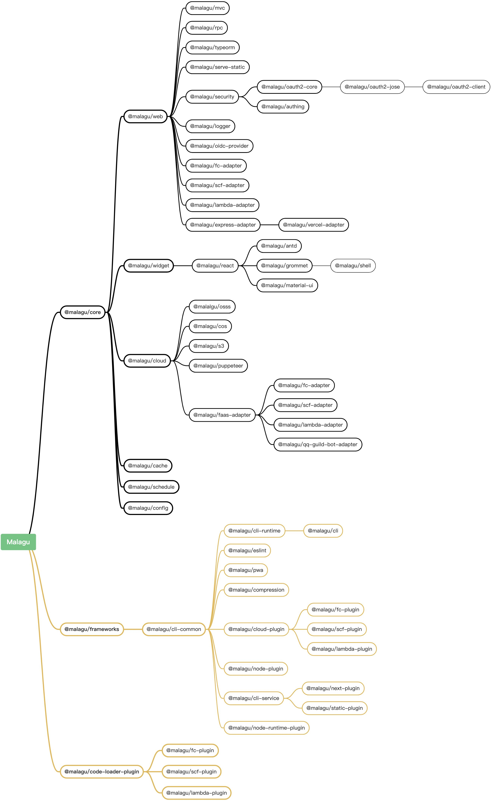

# 基础组件

组件可以基于一个基础组件提供高阶功能。在实现我们的组件的时候，我们可以通过属性配置、依赖注入动态替换等机制等方式扩展基础组件，从而提供高阶的功能。Cell 框架本身也是由一些列组件组成，随着越来越多的组件加入，Cell 框架将提供越来越丰富的功能。比如 Cell 框架的 `@celljs/core` 组件，其他组件几乎直接或者间接依赖于它，它提供了框架最为核心的能力，其他组件基于它可以更方便的提供垂直化的能力，如前端开发、Web 服务、微服务等等。

## Cell 框架包含的基础组件依赖关系如下：

## 基础组件

- `@celljs/core` 核心组件，包含了依赖注入、日志、数据验证等核心能力
- `@celljs/web` Web 组件，包含了 Web 应用核心逻辑的抽象
- `@celljs/mvc` MVC 组件，提供了基于装饰器的 REST 风格 Web API 定义方式
- `@celljs/rpc` RPC 组件，提供了基于装饰器的 RPC 风格 Web API 定义方式
- `@celljs/cache`  缓存管理组件，基于 `cache-manager` 模块实现的缓存管理组件，默认提供内存存储策略，我们也能很方便的使用其他存储策略，如 redis、mongodb、memcached 等等
- `@celljs/schedule` 任务调度组件，提供了基于 Cron 的定时任务调度能力，支持部署 Serverless 平台
- `@celljs/typeorm` 数据库组件，提供了基于 Typeorm 的简化数据库操作相关封装
- `@celljs/security` 安全组件，提供了认证与授权核心逻辑的抽象
- `@celljs/serve-static` 静态资源服务组件，提供了开箱即用的静态资源服务能力
- `@celljs/logger` 日志组件，提供了基于 pino 的高级日志能力
- `@celljs/oidc-provider` OIDC 提供者组件，提供了快速自建 OIDC Provider 服务能力
- `@celljs/fc-adapter` 阿里云函数计算适配器组件，提供了部署到函数计算平台上的能力
- `@celljs/scf-adapter` 腾讯云函数适配器组件，提供了部署到云函数平台上的能力
- `@celljs/lambda-adapter` aws lambda 适配器组件，提供了部署到 lambda 平台上的能力
- `@celljs/vercel-adapter` Vercel 平台适配器组件，提供了部署到 Vercel 平台上的能力
- `@celljs/express-adapter` Express 适配器组件，提供了部署到传统服务器上的能力
- `@celljs/oauth2-core` OAuth2.0 核心组件，提供了基于 OAuth2.0 授权与 OIDC 认证核心逻辑抽象
- `@celljs/oauth2-jose` OAuth2.0 JOSE 组件，提供了对 JOSE 框架的支持
- `@celljs/oauth2-client` OAuth2 客户端组件，提供了 OAuth2.0 授权和 OIDC 认证的客户端能力
- `@celljs/authing` Authing 集成组件，提供了基于 Authing 平台认证与授权的客户端能力
- `@celljs/widget` 前端 Widget 组件，提供了前端主题、国际化、Widget 等等核心逻辑抽象
- `@celljs/react` React 集成组件，提供了对 React 前端框架的集成，零配置、可扩展和装饰器风格的路由配置能力
- `@celljs/antd` Antd 集成组件，提供了 Antd 前端框架开箱即用的能力
- `@celljs/grommet` Grommet 集成组件，提供了 Grommet 前端框架开箱即用的能力
- `@celljs/material-ui` Material UI 集成组件，提供了 Material UI  前端框架开箱即用的能力
- `@celljs/shell` Shell 组件，提供了可扩展、开箱即用的主框架页面
- `@celljs/cloud` 云基础组件，提供多云抽象，屏蔽不同云厂商的云服务底层差异
- `@celljs/oss` 阿里云 oss 服务组件，提供对象存储服务相关操作的实现
- `@celljs/cos` 腾讯云 cos 服务组件，提供对象存储服务相关操作的实现
- `@celljs/s3` 亚马逊云 s3 服务组件，提供对象存储服务相关操作的实现
- `@celljs/puppeteer` Puppeteer 集成组件，基于对象存储服务实现 Puppeteer 的集成
- `@celljs/config` 配置组件，提供运行时组件属性配置能力
- `@celljs/eslint` 代码风格检查插件
- `@celljs/pwa` PWA 插件
- `@celljs/compression` 前端静态文件压缩插件
- `@celljs/cloud-plugin` 云厂商基础插件，提供了关于云厂商的通用能力，比如支持 AKSK 等参数的配置和查看功能
- `@celljs/code-loader-plugin` 代码加载插件，提供了对编译后的代码通用加载能力
- `@celljs/fc-plugin` 阿里云函数计算插件，集成阿里云函数计算，提供部署、查看等能力
- `@celljs/lambda-plugin` AWS Lambda 插件，集成AWS Lambda，提供部署、查看等能力
- `@celljs/next-plugin` Next.js 插件，提供 Next.js 框架项目的构建能力，让 Next.js 也能使用 Cell CLI 进行部署，目前支持阿里云函数计算、腾讯云函数
- `@celljs/node-plugin` Node.js 插件，提供 Node.js 项目通用构建能力。
- `@celljs/node-runtime-plugin` Node.js 运行时插件，提供自定义 Node.js 运行时能力
- `@celljs/scf-plugin` 腾讯云函数插件，集成腾讯云函数，提供部署、查看等能力
- `@celljs/static-plugin` 静态网站插件，提供静态网站项目通用构建能力，Cell 支持 Reactjs、Vuejs、angular 等等前端项目一键部署能力，是通过静态网站插件完成
- `@celljs/cli-service`  命令行服务插件，提供了 Node.js 后端和前端统一的运行、构建能力，以及通用部署抽象

## 其他非组件模块

- `@celljs/cli-common` 命令行集成模块，主要提供组件加载和一些通用的工具类
- `@celljs/cli-runtime` 命令行运行时模块，主要包含与运行时管理相关的命令
- `@celljs/cli` 命令行模块，提供 Cell CLI 所有能力，提供一个应用生命周期基本都会用到的命令实现与抽象，比如初始化、运行、构建、部署、配置、查看等等。大部份的命令只是抽象，命令的具体有特定的组件提供。比如构建与运行是由 @celljs/cli-service 插件提供
- `@celljs/ext-scripts` 脚本模块，提供了组件编译、测试、Lint 等通用脚本
- `@celljs/frameworks` 框架适配模块，Cell CLI 不仅可以构建、运行、部署 Cell 应用框架，还可以是非 Cell 框架的应用。比如 Next.js、Koa.js、Express.js、Nestjs 等数十款框架，未来会持续适配更多框架

说明：插件型组件，主要在应用的编译时使用，是对命令工具能力上的扩展。

