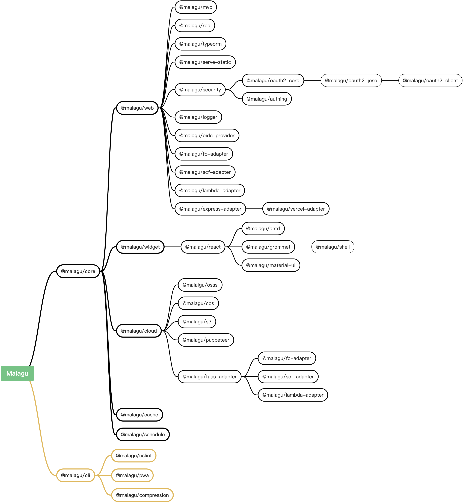

# 基础组件

组件可以基于一个基础组件提供高阶功能。在实现我们的组件的时候，我们可以通过属性配置、依赖注入动态替换等机制等方式扩展基础组件，从而提供高阶的功能。Malagu 框架本身也是由一些列组件组成，随着越来越多的组件加入，Malagu 框架将提供越来越丰富的功能。比如 Malagu 框架的 `@malagu/core` 组件，其他组件几乎直接或者间接依赖于它，它提供了框架最为核心的能力，其他组件基于它可以更方便的提供垂直化的能力，如前端开发、Web 服务、微服务等等。

Malagu 框架包含的基础组件依赖关系如下：

- `@malagu/core` 核心组件，包含了依赖注入、日志、数据验证等核心能力
- `@malagu/web` Web 组件，包含了 Web 应用核心逻辑的抽象
- `@malagu/mvc` MVC 组件，提供了基于装饰器的 REST 风格 Web API 定义方式
- `@malagu/rpc` RPC 组件，提供了基于装饰器的 RPC 风格 Web API 定义方式
- `@malagu/cache`  缓存管理组件，基于 `cache-manager` 模块实现的缓存管理组件，默认提供内存存储策略，我们也能很方便的使用其他存储策略，如 redis、mongodb、memcached 等等
- `@malagu/schedule` 任务调度组件，提供了基于 Cron 的定时任务调度能力，支持部署 Serverless 平台
- `@malagu/typeorm` 数据库组件，提供了基于 Typeorm 的简化数据库操作相关封装
- `@malagu/security` 安全组件，提供了认证与授权核心逻辑的抽象
- `@malagu/serve-static` 静态资源服务组件，提供了开箱即用的静态资源服务能力
- `@malagu/logger` 日志组件，提供了基于 pino 的高级日志能力
- `@malagu/oidc-provider` OIDC 提供者组件，提供了快速自建 OIDC Provider 服务能力
- `@malagu/fc-adapter` 阿里云函数计算适配器组件，提供了部署到函数计算平台上的能力
- `@malagu/scf-adapter` 腾讯云函数适配器组件，提供了部署到云函数平台上的能力
- `@malagu/lambda-adapter` aws lambda 适配器组件，提供了部署到 lambda 平台上的能力
- `@malagu/vercel-adapter` Vercel 平台适配器组件，提供了部署到 Vercel 平台上的能力
- `@malagu/express-adapter` Express 适配器组件，提供了部署到传统服务器上的能力
- `@malagu/oauth2-core` OAuth2.0 核心组件，提供了基于 OAuth2.0 授权与 OIDC 认证核心逻辑抽象
- `@malagu/oauth2-jose` OAuth2.0 JOSE 组件，提供了对 JOSE 框架的支持
- `@malagu/oauth2-client` OAuth2 客户端组件，提供了 OAuth2.0 授权和 OIDC 认证的客户端能力
- `@malagu/authing` Authing 集成组件，提供了基于 Authing 平台认证与授权的客户端能力
- `@malagu/widget` 前端 Widget 组件，提供了前端主题、国际化、Widget 等等核心逻辑抽象
- `@malagu/react` React 集成组件，提供了对 React 前端框架的集成，零配置、可扩展和装饰器风格的路由配置能力
- `@malagu/antd` Antd 集成组件，提供了 Antd 前端框架开箱即用的能力
- `@malagu/grommet` Grommet 集成组件，提供了 Grommet 前端框架开箱即用的能力
- `@malagu/material-ui` Material UI 集成组件，提供了 Material UI  前端框架开箱即用的能力
- `@malagu/shell` Shell 组件，提供了可扩展、开箱即用的主框架页面
- `@malagu/cloud` 云基础组件，提供多云抽象，屏蔽不同云厂商的云服务底层差异
- `@malagu/oss` 阿里云 oss 服务组件，提供对象存储服务相关操作的实现
- `@malagu/cos` 腾讯云 cos 服务组件，提供对象存储服务相关操作的实现
- `@malagu/s3` 亚马逊云 s3 服务组件，提供对象存储服务相关操作的实现
- `@malagu/puppeteer` Puppeteer 集成组件，基于对象存储服务实现 Puppeteer 的集成
- `@malagu/eslint` 代码风格检查组件
- `@malagu/pwa` PWA 组件
- `@malagu/compression` 前端静态文件压缩组件
