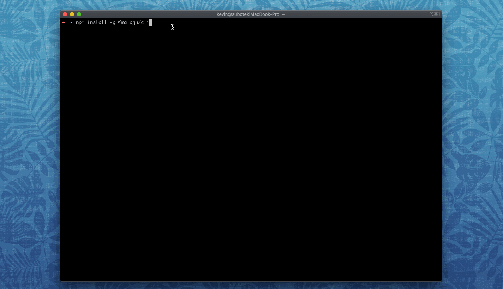

# 快速开始

```bash
# 1.安装命令行工具
npm install -g @malagu/cli

# 2.初始化一个项目
malagu init project-name
cd project-name # 进入项目根目录

# 3.本地运行测试
malagu serve

# 4.部署上线，首次部署会提示输入相关云平台 Ak 信息
malagu deploy
```

<br />
