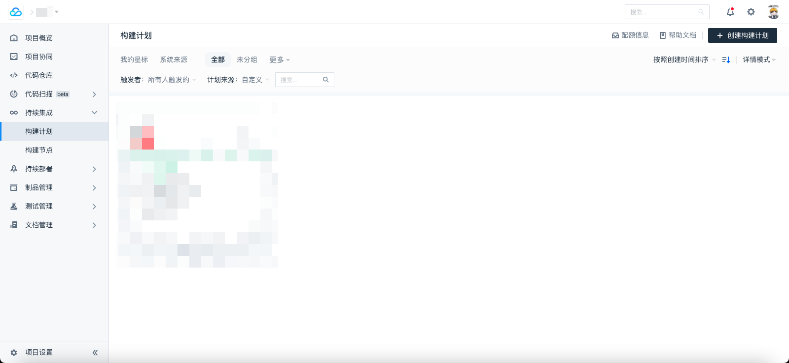
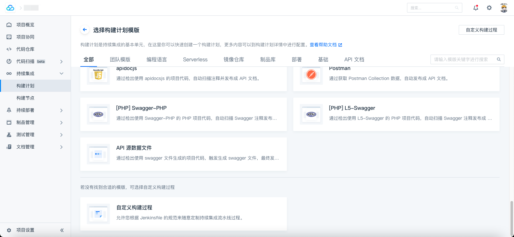
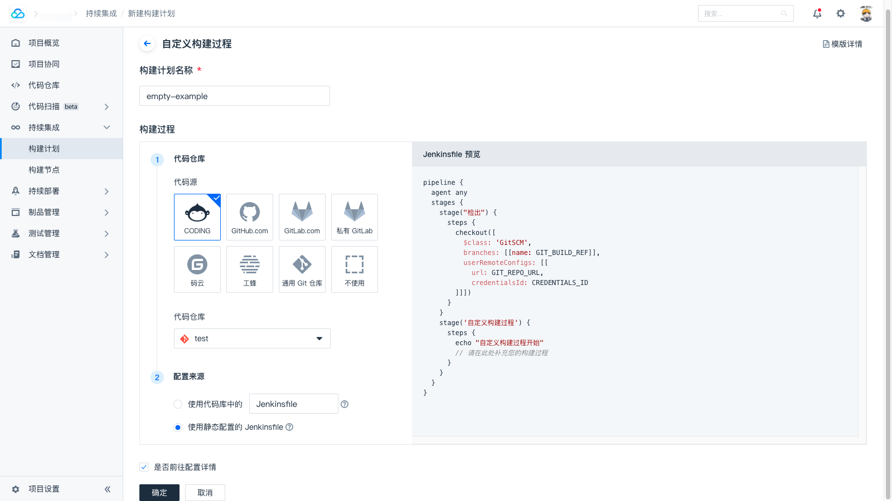
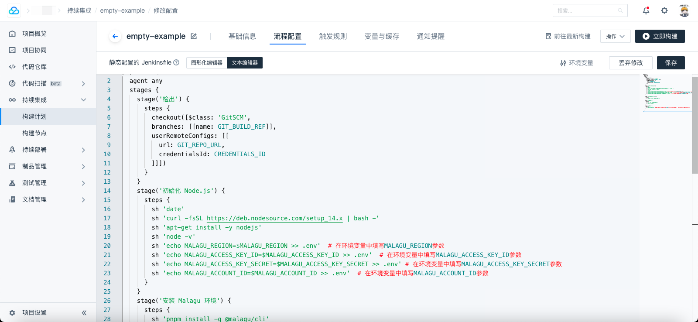
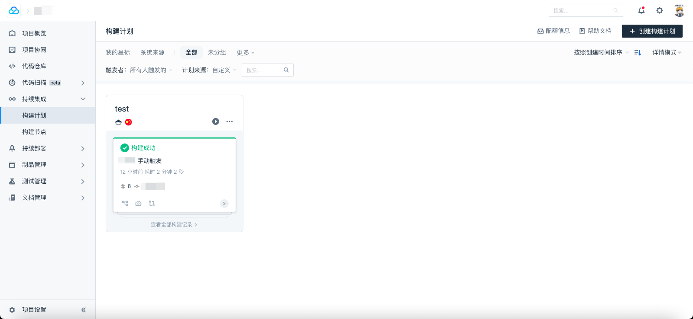

---

title: 持续集成和持续部署（CICD）
order: 18.8
toc: menu
---

# 持续集成和持续部署（CICD）

在一个多人的开发团队，为了提升集成和部署的效率，同时也为了一些秘钥的安全性，我们需要提供持续集成和持续部署（CICD）能力。供持续集成和持续部署（CICD）的关键在于我们如何将秘钥注入到 CICD 的环境中，已经框架如何正确的获取该秘钥。注入秘钥一般由相关的平台来做，比如 GitHub；而获取秘钥，一般是由应用本身来处理。

## 框架默认提供 CICD 脚本


Malagu 框架提供了一系列开箱即用的模板，在模板中，默认提供了基于 GitHub Actions 实现 CICD 脚本，我们只需要在平台中注入相应的秘钥即可使用。脚本如下：


```yaml
name: Malagu Deploy

on: push

jobs:
  malagu-deploy:
    runs-on: ubuntu-latest
    steps:
      - uses: actions/checkout@v2
      - name: Setup node
        uses: actions/setup-node@v1
        with:
          node-version: '12'
      - uses: bahmutov/npm-install@v1
      - run: npm run lint --if-present  # 存在代码风格检查命令则执行该代码风格检查命令
      - run: npm test                   # 执行测试命令
      - if: ${{ github.ref == 'refs/heads/master' }}  # 如果提交的主分支，则部署到生成环境
        env: ${{ secrets }}
        run: npx malagu deploy -m prod
      - if: ${{ github.ref == 'refs/heads/pre' }} # 如果提交的 pre 分支，则部署到预发环境
        env: ${{ secrets }}
        run: npx malagu deploy -m pre
      - if: ${{ github.ref != 'refs/heads/master' && github.ref != 'refs/heads/pre' }} # 如果提交的既不是主分支，又不是 pre 分支，则部署到测试环境
        env: ${{ secrets }}
        run: npx malagu deploy -m test
```


说明：

- 如果提交的主分支，则部署到生成环境： `npx malagu deploy -m prod` 
- 如果提交的 pre 分支，则部署到预发环境: `npx malagu deploy -m pre`
- 如果提交的既不是主分支，又不是 pre 分支，则部署到测试环境: `npx malagu deploy -m test`


## 如何获取注入的秘钥


GitHub 平台会将秘钥，通过环境变量注入到 CICD 运行环境中，在 Malagu 框架中，我们可以通过属性配置文件引用当前环境中的环境变量，如下所示：
```yaml
password: ${env.PASSWORD}
```


## 云厂商必须配置的秘钥


如果需要部署到云厂商的 Serverless 平台上，需要将相关的 AKSK 相信配置为秘钥，并注入到 CICD 环境中，配置一下秘钥即可：
```
MALAGU_REGION
MALAGU_ACCESS_KEY_ID
MALAGU_ACCESS_KEY_SECRET
MALAGU_ACCOUNT_ID # 部分云厂商可以不提供
```

## Coding持续集成

脚本如下：

```yaml
pipeline {
  agent any
  stages {
    stage('检出') {
      steps {
        checkout([$class: 'GitSCM',
        branches: [[name: GIT_BUILD_REF]],
        userRemoteConfigs: [[
          url: GIT_REPO_URL,
          credentialsId: CREDENTIALS_ID
        ]]])
      }
    }
    stage('初始化 Node.js') {
      steps {
        sh 'date'
        sh 'curl -fsSL https://deb.nodesource.com/setup_14.x | bash -'
        sh 'apt-get install -y nodejs'
        sh 'node -v'
        sh 'echo MALAGU_REGION=$MALAGU_REGION >> .env'  # 在环境变量中填写MALAGU_REGION参数
        sh 'echo MALAGU_ACCESS_KEY_ID=$MALAGU_ACCESS_KEY_ID >> .env'  # 在环境变量中填写MALAGU_ACCESS_KEY_ID参数
        sh 'echo MALAGU_ACCESS_KEY_SECRET=$MALAGU_ACCESS_KEY_SECRET >> .env' # 在环境变量中填写MALAGU_ACCESS_KEY_SECRET参数
        sh 'echo MALAGU_ACCOUNT_ID=$MALAGU_ACCOUNT_ID >> .env'  # 在环境变量中填写MALAGU_ACCOUNT_ID参数
      }
    }
    stage('安装 Malagu 环境') {
      steps {
        sh 'pnpm install -g @malagu/cli'
      }
    }
    stage('安装依赖') {
      steps {
        sh 'rm -rf ./node_modules'
        sh 'yarn install'
      }
    }
    stage('部署应用') {
      steps {
        sh 'malagu deploy'  # 这里可以参照框架提供的GitHub脚本，对不同的分支执行不同的命令，部署到不同的环境
      }
    }
  }
}
```

使用方法：

1. 在Coding `持续集成-构建计划` 页面中，点击右上角 `创建构建计划` 

    

    

    

2. 在 `选择构建计划模版`  页面中，选择 `自定义构建过程` 

    

    

    

3. 填写自定义构建过程中的 `构建计划名称` ，选择代码仓库，配置来源选择 `使用静态的Jenkinsfile` ,（也可以将配置信息放入代码仓库，使用代码库中的Jenkinsfile）,

    

    

    

4. 在 `流程配置-文本编辑器`  中，填入上述脚本，在 `环境变量` 中，填入脚本中所需的参数,（即云平台部署中所需的env参数，可参考云平台文档中的配置说明）,点击保存

    

    

    

5. 返回 `构建计划` ，点击 `立即构建` ，此时已经可以成功构建，前往云平台控制台，可发现函数已经成功部署。


    

    

    

    

    


