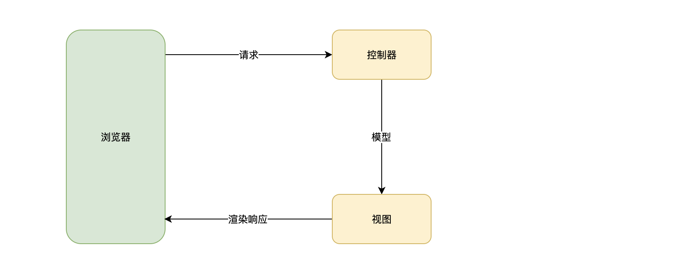

# 控制器

## 前言


控制器负责处理传入的**请求**并将**模型**返回**视图**，再有**视图**输出给浏览器。如下图所示：





控制器的目的是接收对应用程序的特定请求。而**路由**决定了控制器中的哪个处理器方法处理该请求。通常，每个控制器具有多个路由，并且不同的路由可以执行不同的方法。


为了创建一个基本的控制器，我们使用类和**装饰器**。装饰器将类与所需的元数据相关联，并使框架能够创建路由映射（将请求绑定到相应的控制器）。


控制器中的处理器方法返回的模型会经过对应的视图进行处理，最终通过输出给浏览器。


## 安装


控制器功能在 `@malagu/mvc` 组件中实现，该组件依赖 `@malagu/web` 组件，`@malagu/web` 是 HTTP 请求处理能力的抽象，具体如何定义、路由匹配该请求处理器交由子组件`@malagu/mvc` 、`@malagu/rpc` 等等实现，您也可以实现其他风格的子组件。

- `@malagu/mvc` REST 风格的请求路由映射
- `@malagu/rpc` RPC 风格的请求路由映射


使用 `@malagu/web` 前，需要在您的项目中安装该组件。
```bash
$ yarn add @malagu/mvc  # npm install @malagu/mvc
```


## 路由


在下面的示例中，我们将使用 `@Controller()` 装饰器，它是定义基本控制器所**必需的**。我们将指定一个可选的路由路径前缀 `users`。在 `@Controller()` 装饰器中使用路径前缀可以使我们轻松地对一组相关的路由进行分组，并最大程度地减少重复代码。例如，我们可以选择对一组路由进行分组，以管理与该路由下的用户实体的交互 `/users`。在这种情况下，我们可以把 `users` 在 `@Controller()` 装饰器中指定路径前缀，这样就不必为控制器中的每个路由重复路径的那部分。


```typescript
import { Controller, Get } from '@malagu/mvc/lib/node';

@Controller('users')
export class UserController {
    
    @Get()
    list(): User[] {
        return [];
    }
}
```
`@Get()` 在该 `list()` 方法上，相当于告诉框架该方法为某个 HTTP 请求的终端处理器，什么样的 HTTP  请求该方法和路由可以匹配到该处理器呢？在上面的示例中，我们可以通过 `GET /users`  HTTP 请求可以访问到该处理器，假如该 `list()` 方法上的装饰器为 `@Get('profile')` ，则框架会为其生成请求路由映射： `GET /users/profile` 。


在上面的示例中，当对此端点发出 GET 请求时，框架将请求路由到我们的用户定义的 `list()` 方法。请注意，我们在此处选择的方法名称完全是任意的。显然，我们必须声明一个将路由绑定到的方法，但是框架不对选择的方法名称赋予任何意义。


## 视图


控制器的请求处理方法的返回值可以是可以任意类型，也支持 Promise 异步方法，默认会按照 JSON 对象来处理，也就是使用 JSON 视图来处理成合适 HTTP 请求响应格式。我们可以在该方法上通过 `@View('text')` 装饰器改变单个处理器的默认行为，我们也可以通过配置属性 `malagu.mvc.defaultViewName` 全局改变全局处理器的默认行为。目前框架默认提供了 text、json、html 视图实现。您也可以扩展实现自己的视图。


```typescript
@Controller('users')
export class UserController {

    @Get(':id')
    @Json()
  	get(@Param() id: string) {
        ...
    } 
}
```


## 请求方法


框架提供了标准的 HTTP 请求方法装饰：


- `@Get()`
- `@Post()`
- `@Put()`
- `@Delete()`
- `@Patch()`
- `@Options()`
- `@Head()`


## 路由通配符


控制器还支持基于模式的路由。我们可以使用字符串和正则表达式来定义模式。例如， `*` 用作通配符，它将匹配任何字符组合。具体示例如下：

- /`api/* ` 匹配以 `/api/` 开头的路由
- `/users/:id ` 匹配类似 `/users/5` 的路由，然后通过 `@Param('id')` 可以取到路由 id 片段的值
- `/^\/api\/(.*)$/`  匹配以 `/api/` 开头的路由


下面代码相当于定义一个为 `/users/:id ` 的路由规则。从代码中我们可以了解到，我们不需要额外加上不同路由片段之间的 `/` ，框架在组装路由片段的时候，如果发现缺少必要的 `/` 会自动加上。


```typescript
import { Controller, Get } from '@malagu/mvc/lib/node';

@Controller('users')
export class UserController {
    
    @Get(':id')
  	get(@Param('id') id: string, @Body('foo') foo: string) {
        ...
    } 
}
```


## 请求和响应对象


我们一般情况下使用的请求和响应对象是框架抽象了一层的对象，当然，您也可以使用原始的请求和响应对象，比如 Express 的请求和响应对象。但是我们不推荐您这么做。


```typescript
import { Controller, Get } from '@malagu/mvc/lib/node';
import { Context } from '@malagu/web/lib/node';

@Controller('users')
export class UserController {
    
    @Get()
    list(): User[] {
        const request = Context.getRequest();
        const response = Context.getRequest();
        return [];
    }
}
```


## 获取请求相关的属性


Malagu 框架提供一系列装饰器用于将请求相关的属性注入到控制器方法的参数里面。


#### @Param


获取路由变量，如请求是 `/users/123` ，控制器的路由规则 `/users/:id` ，通过 `@Param` 装饰器就可以取到路由里面的 id 变量的值 `123` 。


取路由中的某一个变量：


```typescript
@Controller('users')
export class UserController {

    @Get(':id')
  	get(@Param('id') id: string) {
        ...
    } 
}
```


取路由中的所有变量：


```typescript
@Controller('users')
export class UserController {

    @Get(':id')
  	get(@Param() param: any) {
        const id = param.id;
        ...
    } 
}
```


#### @Query


获取请求查询参数，如请求是 `/users?id=123` ，控制器的路由规则 `/users` ，通过 `@Query` 装饰器就可以取到请求查询参数里面的 id 参数的值 `123` 。


取请求查询参数中的某一个参数：


```typescript
@Controller('users')
export class UserController {

    @Get()
  	get(@Query('id') id: string) {
        ...
    } 
}
```


取请求查询参数中的所有参数：


```typescript
@Controller('users')
export class UserController {

    @Get()
  	get(@Query() query: any) {
        const id = query.id;
        ...
    } 
}
```


#### @Body


获取请求体。


取请求体中的某一个属性：


```typescript
@Controller('users')
export class UserController {

    @Get(':id')
  	get(@Param('id') id: string, @Body('foo') foo: string) {
        ...
    } 
}
```


取请求体中的所有属性：


```typescript
@Controller('users')
export class UserController {

    @Get(':id')
  	get(@Param('id') id: string, @Body() body: any) {
        ...
    } 
}
```


#### @Header


获取请求头。


取请求头中的某一个属性：


```typescript
@Controller('users')
export class UserController {

    @Get(':id')
  	get(@Param('id') id: string, @Header('Content-Type') contentType: string) {
        ...
    } 
}
```


取请求头中的所有属性：


```typescript
@Controller('users')
export class UserController {

    @Get(':id')
  	get(@Param('id') id: string, @Header() header: any) {
        ...
    } 
}
```


#### @Cookie


获取请求中的 Cookie 信息。


取请求中的某个 cookie 属性值：


```typescript
@Controller('users')
export class UserController {

    @Get(':id')
  	get(@Param('id') id: string, @Cookie('foo') foo: string) {
        ...
    } 
}
```


取请求中的所有 cookie 属性值：


```typescript
@Controller('users')
export class UserController {

    @Get(':id')
  	get(@Param('id') id: string, @Cookie() cookies: any) {
        const foo = cookies.get('foo'); // 也可以设置 cookie，cookies.set('foo', 'bar');
        ...
    } 
}
```


#### @Session


获取 Session 信息。


取请求中的某个 session 属性值：


```typescript
@Controller('users')
export class UserController {

    @Get(':id')
  	get(@Param('id') id: string, @Session('foo') foo: string) {
        ...
    } 
}
```


取请求中的所有 Session 属性值：


```typescript
@Controller('users')
export class UserController {

    @Get(':id')
  	get(@Param('id') id: string, @Session() session: any) {
        const foo = session.foo;  // 也可以设置 session，session.foo = 'bar';
        ...
    } 
}
```


## 设置响应相关的属性


Malagu 框架提供一系列装饰器用于将值输出到响应头、Cookie 和 Session 里面。


#### @Header


设置请求头。


```typescript
@Controller('users')
export class UserController {

    @Get(':id')
  	@Header('Content-type', 'application/json')
  	get(@Param('id') id: string) {
        ...
    } 
}
```


#### @Cookie


设置 Cookie。


```typescript
@Controller('users')
export class UserController {

    @Get(':id')
  	@Cookie('foo', 'bar')
  	get(@Param('id') id: string) {
        ...
    } 
}
```


#### @Session


设置 Session。


```typescript
@Controller('users')
export class UserController {

    @Get(':id')
  	@Session('foo', 'bar')
  	get(@Param('id') id: string) {
        ...
    } 
}
```


## 异步


在大部分场景下，我们的处理器方法往往是异步的，框架支持异步处理器方法，按照原有的方式使用 Promise、await/async 即可。
```typescript
import { Controller, Get } from '@malagu/mvc/lib/node';

@Controller('users')
export class UserController {
    
    @Get()
    async list(): Promise<User[]> {
        return [];
    }
}
```


## 错误处理


在 mvc 组件中，我们提供了一个装饰器 `@Catch()` 帮助我们处理控制器当中抛出的异常。异常处理器方法必须定义在控制器当中，与 HTTP 请求处理器相似，不同的是异常处理器方法匹配的是具体的异常。异常处理器有以下规则：


- 只有控制器里面抛出的异常才会走异常映射流程
- 异常类必须继承 CustomError 基类，或者您提供的异常对象支持 instanceof 语法
- `@Catch` 的使用不需要与抛异常的控制器是同一个
- 异常控制器方法会继承抛异常的控制器方法的上下文，包括视图、请求的各种属性


```typescript
@Controller()
export class ErrorController {
  	@Catch(FooError)
  	handle(err: FooError, @Body() body) {
        ...
    }
}
```


更多有关于处理错误的信息，单独的一章[在这里](https://www.yuque.com/cellbang/malagu/cwuk7q)。


