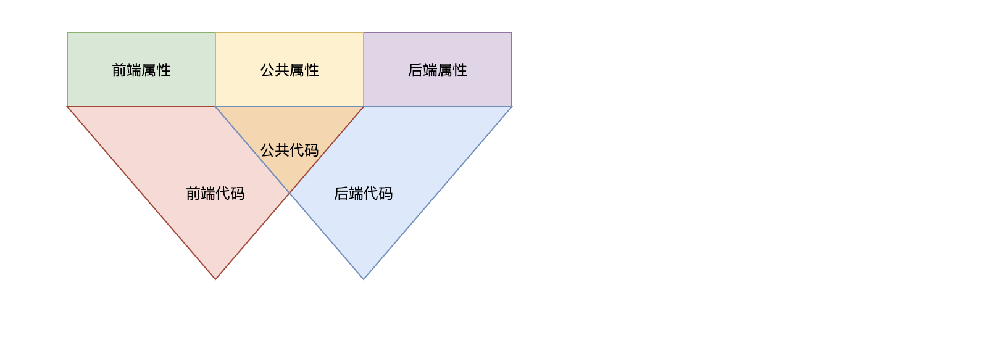
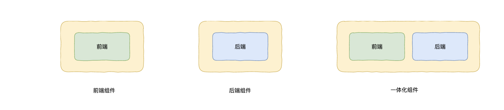
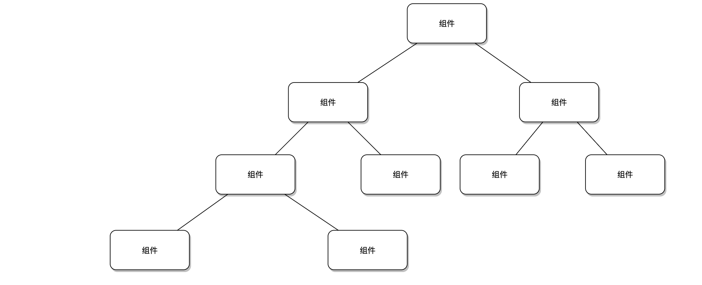
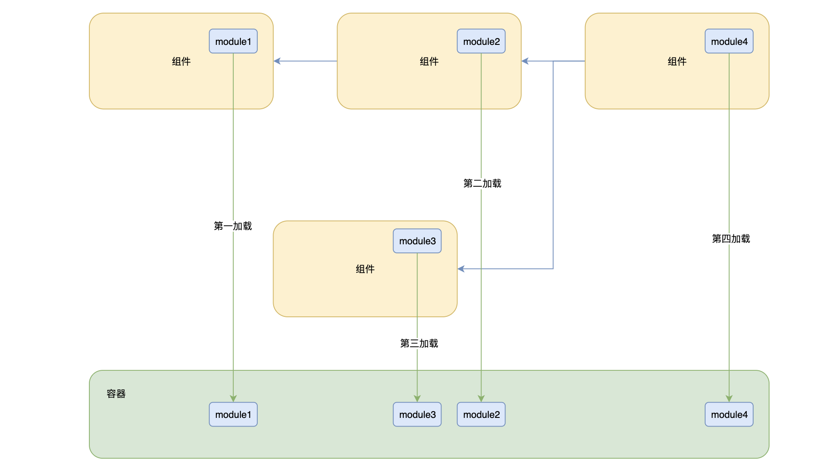

# 组件设计

## 背景


一个应用随着业务的发展往往会变得越来越复杂和臃肿，不同应用之间又往往存在不同维度的共性。组件化能很好的解决上面的问题：

- 通过将复杂和臃肿的应用横向拆分成一个个业务组件
- 通过把存在共性的不同应用纵向提炼抽象成一个个基础组件


另外，Malagu 框架本身也是一个特别复杂的项目，Malagu 框架同样可以基于自身的组件机制来实现，让 Malagu 框架更具活力。


## 目标


- 可配置性
- 可扩展性
- 可编排性
- 简单易用性
- 可积累性
- 可分享性


## 组件内部结构





**说明：**

- 长方形表示组件属性，包含前端属性、后端属性和公共属性
- 红色三角形表示前端代码
- 蓝色三角形表示后端代码
- 红色和蓝色三角形交集橙色三角形表示公共代码
- 前端代码可以访问公共代码、公共属性和前端属性
- 后端代码可以访问公共代码、公共属性和后端属性
- 公共代码只能访问公共属性


## 组件目录结构


下面是一个前后端一体化组件的代码目录结构，组件也是一个标准 node 模块，在根目录可以放置组件属性配置文件，如下面的 malagu.yml 文件，模式属性配置文件也是放在根目录位置。源代码目录划分成三个目录：前端代码目录（browser）、公共代码目录（common）和后端代码目录（node）。您可以更加具体情况，增删目录，如果组件是一个纯后端组件，browser 和 common 目录可以不需要。组件目录结构中的源代码目录不会强制您按照下面的方式来组织，只不过官方提供的基础组件会按照下面的方式来组织，当然，如果需要开发自己的组件，框架推荐使用与我们相同的组织方式。
```
.
├── malagu.yml                            # 组件配置【可选】
├── package.json
├── src
│   ├── browser                           # 前端代码目录【可选】
│   │   ├── application-lifecycle.ts
│   │   ├── module.ts
│   │   └── user.view.tsx
│   ├── common                            # 公共代码目录【可选】
│   │   ├── index.ts
│   │   └── user-protocol.ts
│   └── node                              # 后端代码目录【可选】
│       ├── entity
│       │   ├── index.ts
│       │   └── user.ts
│       ├── module.ts
│       └── user-service.ts
└── tsconfig.json
```
​

## 组件形态


**组件包含四种种形态：**
**​**


- 前端组件【运行时】
- 后端组件【运行时】
- 一体化组件【运行时】
- 命令行组件【编译时】


其中运行时组件，如下图所示：





## 组件之间关系


**说明：**

- 组件之间存在依赖关系
- 组件之间的依赖关系决定了组件的加载顺序和组件配置优先级，被依赖的组件先于依赖者加载且配置属性优先级低


## 组件属性


#### 配置方式


组件属性通过 yaml 文件来配置，默认在组件项目的根目录下加载 `malagu.yml` 属性文件，当 `malagu.yml` 配置了属性 `mode: test` ，则尝试加载根目录的 `malagu-test.yml` 属性文件，规则是： `malagu-[mode].yml` 。


配置文件分类如下：

- 公共属性文件：`malagu.yml`
- 模式属性文件：`malagu-[mode].yml`


#### 模式属性


模式属性，在特定模式下才会生效的属性。模式与环境的关系是多对多的关系，即一个环境对应着一个或多个模式，不同环境之间可以复用同一个的模式。


模式的本质是告诉框架如何加载合并组件的配置文件，以及配置文件的加载顺序（优先加载的属性文件的属性优先级越低）。


_**有两种方式指定模式**_


1. 属性文件中配置 `mode`
1. 命令行指定选项 `--mode,-m` ，支持模式的命令有：
   1. `malagu serve`
   1. `malagu build`
   1. `malagu deploy`


示例一：通过属性文件配置
```yaml
# 指定单个模式，该模式下，会尝试加载所有组件的 malagu.yml 和 malagu-prod.yml
mode: prod  

#指定多模式，该模式下，会尝试加载所有组件的 malagu.yml、malagu-prod1.yml 和 malagu-prod2.yml
mode: [prod1, prod2]
```


示例二：通过命令行选项配置


```bash
# 指定单个模式，该模式下，会尝试加载所有组件的 malagu.yml 和 malagu-prod.yml
malagu deploy -m prod

#指定多模式，该模式下，会尝试加载所有组件的 malagu.yml、malagu-prod1.yml 和 malagu-prod2
malagu deploy -m prod1,prod2

```


当即通过属性文件配置，又通过命令行选项配置时，框架将两者配置进行合并，命令行选项配置的模式优先级比属性文件配置高。


_**模式属性优先级规则**_


- malagu.yml < malagu-[mode].yml
- 多模式情况下，写在前面的模式优先级低，例如模式为 prod1,prod2，则 prod2 的属性优先级大于 prod1 的属性
- 属性文件配置的模式 < 命令行选项配置的模式


#### 属性划分


在属性文件中可以配置：

- 公共属性
- 前端属性
- 后端属性


其中， `frontend` 下面的都是前端属性； `backend` 下面的都是后端属性，其他的为公共属性。


1. 前端属性示例


```yaml
frontend:
	malagu:
  	foo: bar
```


2. 后端属性示例


```yaml
backend:
	malagu:
  	foo: bar
```


3. 公共属性示例


```yaml
malagu:
 foo: bar
```


还有一种维度的划分：

- 编译时属性
- 运行时属性


#### 属性优先级规则


_**泛化原则**_


泛化的属性优先级低（以下规则优先级由高到底）：

- 前端(后端)属性 > 公共属性
- 模式属性文件 > 公共属性文件


_**依赖原则**_


被依赖的组件属性优先级低：

- 依赖者属性 > 被依赖者属性


当以上两个原则存在冲突时：

- 泛化原则 > 依赖原则


#### 属性规范


- 前后端代码都需要访问的属性设计成公共属性
- 公共代码只访问公共属性
- 属性层级设计：[业务名].[组件名].[属性]
- 属性命名规则：采用小驼峰（推荐）
- 属性最好提供默认值


#### 属性模板变量


属性值可以使用表达式来引用其他的属性值或者环境变量值。


1. 引用其他属性值
```yaml
port: 3000
host: localhost
url: 'https://${host}:${port}'

```


2. 引用环境变量值
```yaml
password: ${env.PASSWORD}
```


3. 默认值设置
```yaml
password: '${env.PASSWORD?:123456}'
```

4. 忽略表达式计算


如下属性配置，因为 test 节点存在属性 `_ignoreEl` 为 true，则 test 节点下的属性或者属性的属性的值不在进行表达式计算。
```yaml
test:
	a: '${b > 0 ? true: false}'
  _ignoreEl: true 
```
上面的方案是对某个一个节点进行表达式计算忽略，如何只对单一属性值就行表达式忽略呢？我们可以通过转义符实现。如下：
```yaml
test:
	a: '\\${b > 0 ? true: false}'

```


5. 运行时表达式


上面的写法是在项目编译期间计算表达式的值，如果您需要在应用运行时取运行时的环境变量的话，如下：
```yaml
password: '${{env.PASSWORD?:123456}}'
```


6. 运行时正则表达式配置

​

属性文件不太方便配置正则表达式值，框架特意为此提供专门的转换函数，方便开发者在属性文件中配置正则表达式，如下：
```yaml
origin: ${{'.*\.google\.com$'|regexp}} 
```


表达式更多语法规则请看：[Jexl](https://github.com/TomFrost/jexl#jexl-)。


## 组件使用


一个组件就是一个 npm 包，组件的使用与 npm 包的使用是一样的。但是，对两个平级的组件而言， package.json 中的依赖顺序会决定组件的加载顺序。


## 组件加载


Malagu 推荐使用容器来管理对象之间的依赖，也正是把对象放到容器中托管，才让组件具备极强的扩展性，让组件适用更多的场景。对于一个 Malagu 的应用，可能有一个或者多个组件组成，想让应用能够正常跑起来，就必须按照合理的加载顺序，分别加载组件中需要托管到容器的对象。


组件加载机制如下图：




从上图可以看出，组件的对象在 `module` 中声明后，只需要把组件按依赖关系的进行拓扑排序，被依赖的组件优先加载，平级组件按照先后顺序加载，容器按照拓扑排序后的顺序加载 `module` ，最终构建出整个完成的容器。


## 组件扩展


#### 扩展方法


自定义一个组件，且依赖需要被扩展的组件，通过属性覆盖、实现扩展接口和直接替换组件内部实现来扩展或改变组件的行为。


#### 扩展策略


- 属性扩展，基于组件属性优先级规则
- 接口扩展，组件将可变的逻辑抽象为接口，子组件通过实现该接口达到扩展组件的目的
- 实现扩展，组件内的任何实现（实现没有抽象成接口），子组件都可以通过 rebind 的方式替换掉


#### 扩展能力来源


- 组件属性优先级规则
- 组件的代码实现都托管于容器（IOC）


