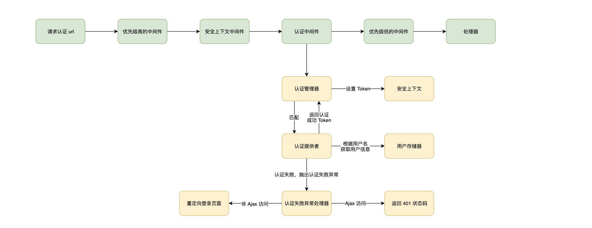

# 认证机制

**说明：**

- 安全上下文中间件负责尝试从 Session 还原安全上下文内容
- 所有的请求都会到达认证管理器，认证管理器会尝试匹配认证提供，如果该请求没有匹配到认证提供者，则忽略，继续往下执行后面的中间件
- 认证管理器可能匹配到多个认证提供者，只要其中存在一个是认证通过的，则表示认证通过
- 框架默认的认证提供者会尝试从请求参数和 body 中获取用户名和密码，通过用户名从用户存储器中加载用户信息，用户不存在，则抛出认证异常，认证失败，如果存在，则会继续校验密码是否正确，另外还有一些其他用户状态的校验，都通过了，则认证成功
- 认证成功后，返回 Token，Token 中往往包含了用户基本信息，Token 会设置到安全上下文中，安全上下文中的内容会持久化到 Session 中
- 您可以通过实现自己认证提供者，满足自己业务特殊的认证需求
- 您可以通过属性配置自定义自己的登录页面地址、登录成功地址等等
- 密码加密采用随机盐 + 秘钥的 Pbkdf2 的哈希算法，框架提供了一个默认秘钥，真实场景记得一定要改成您自己的秘钥。当然，您也可以自定义哈希算法