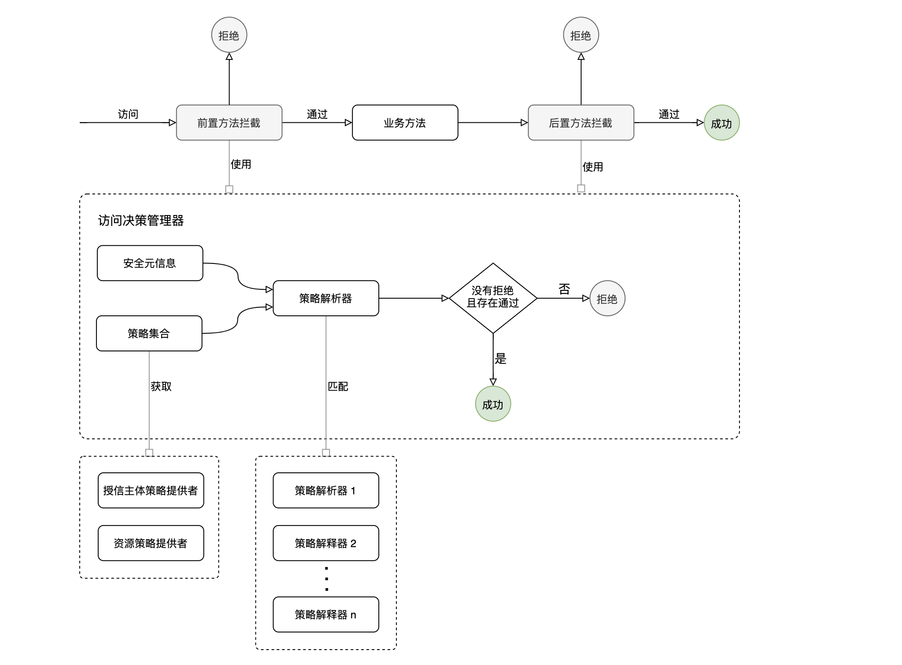

# 访问控制机制

**说明：**

- 访问控制是通过 AOP 机制实现
- 访问控制过程包含前置访问控制和后置访问控制
- 安全元信息包含资源、操作、授信主体、授权类型和策略
- 通过安全元信息中的授信主体和资源名称，我们分别获得资源权限策略和授信主体权限策略，然后根据策略类型匹配合适的策略解释器，策略解析器根据安全元信息和策略进行解析。
- 一般情况下，一种类型的策略对应一个策略解释器，可以根据业务需要定义自己的策略语法规则。
- 策略可以所属授信主体，也可以所属资源，策略可以在代码写死，也可以配置文件配置，还可以存储在数据库当中
- 授信主体一般是系统用户，也可以是其他逻辑上的授信主体
- 访问控制过程中，在解释所有权限策略的时候，只要存在一条策略不通过，则拒绝访问；且必须存在一条策略是通过的，才能成功访问